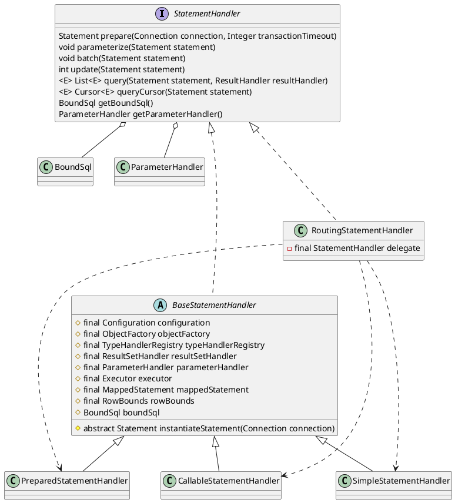

org.apache.ibatis.executor.statement.StatementHandler

## hierarchy
```
StatementHandler (org.apache.ibatis.executor.statement)
    RoutingStatementHandler (org.apache.ibatis.executor.statement)
    BaseStatementHandler (org.apache.ibatis.executor.statement)
        PreparedStatementHandler (org.apache.ibatis.executor.statement)
        CallableStatementHandler (org.apache.ibatis.executor.statement)
        SimpleStatementHandler (org.apache.ibatis.executor.statement)
```


## overview




## RoutingStatementHandler
路由语句处理：根据MappedStatement.statementType枚举类型，构造具体的实现