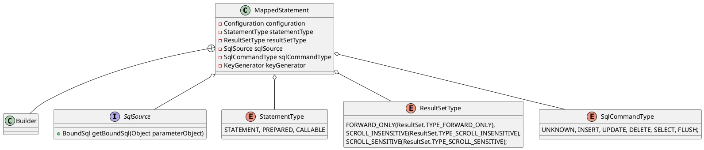

org.apache.ibatis.mapping.MappedStatement

## define

```plantuml
@startuml

class MappedStatement {
    - Configuration configuration
    - StatementType statementType
    - ResultSetType resultSetType
    - SqlSource sqlSource
    - SqlCommandType sqlCommandType
    - KeyGenerator keyGenerator
}

''''''''''''''''''''' 建造者 ''''''''''''''''''''''
class Builder 
MappedStatement +-- Builder


interface SqlSource {
  + BoundSql getBoundSql(Object parameterObject)
}
MappedStatement o-- SqlSource

enum StatementType {
  STATEMENT, PREPARED, CALLABLE
}
MappedStatement o-- StatementType

enum ResultSetType {
  FORWARD_ONLY(ResultSet.TYPE_FORWARD_ONLY),
  SCROLL_INSENSITIVE(ResultSet.TYPE_SCROLL_INSENSITIVE),
  SCROLL_SENSITIVE(ResultSet.TYPE_SCROLL_SENSITIVE);
}
MappedStatement o-- ResultSetType

enum SqlCommandType {
  UNKNOWN, INSERT, UPDATE, DELETE, SELECT, FLUSH;
}
MappedStatement o-- SqlCommandType
@enduml
```