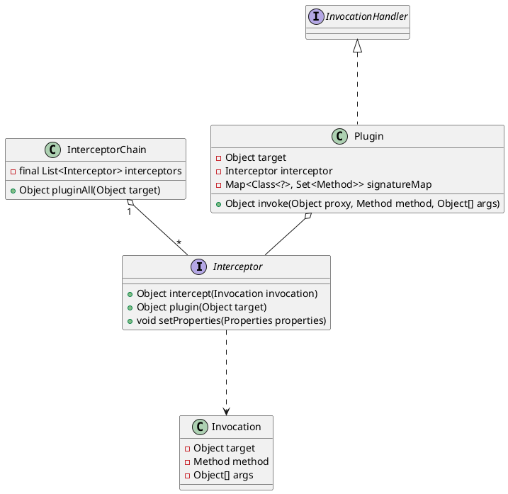

## package
org.apache.ibatis.plugin
```
    Interceptor
    InterceptorChain
    Intercepts
    Invocation
    Plugin
    PluginException
    Signature
```

## overview


```plantuml
@startuml

''''''''''''''''''''''' 拦截器 '''''''''''''''''''''''''''
interface Interceptor {
    + Object intercept(Invocation invocation)
    + Object plugin(Object target)
    + void setProperties(Properties properties)
}
Interceptor -.-> Invocation

''''''''''''''''''''''' 拦截器链 '''''''''''''''''''''''''''
class InterceptorChain {
    - final List<Interceptor> interceptors
    + Object pluginAll(Object target)
}
InterceptorChain "1" o-- "*" Interceptor

''''''''''''''''''''''' 调用器 '''''''''''''''''''''''''''
class Invocation {
    - Object target
    - Method method
    - Object[] args
}

''''''''''''''''''''''' 插件（增强逻辑） '''''''''''''''''''''''''''
interface InvocationHandler
class Plugin {
    - Object target
    - Interceptor interceptor
    - Map<Class<?>, Set<Method>> signatureMap
    + Object invoke(Object proxy, Method method, Object[] args)
}
Plugin o-- Interceptor
InvocationHandler <|-.- Plugin

@enduml
```