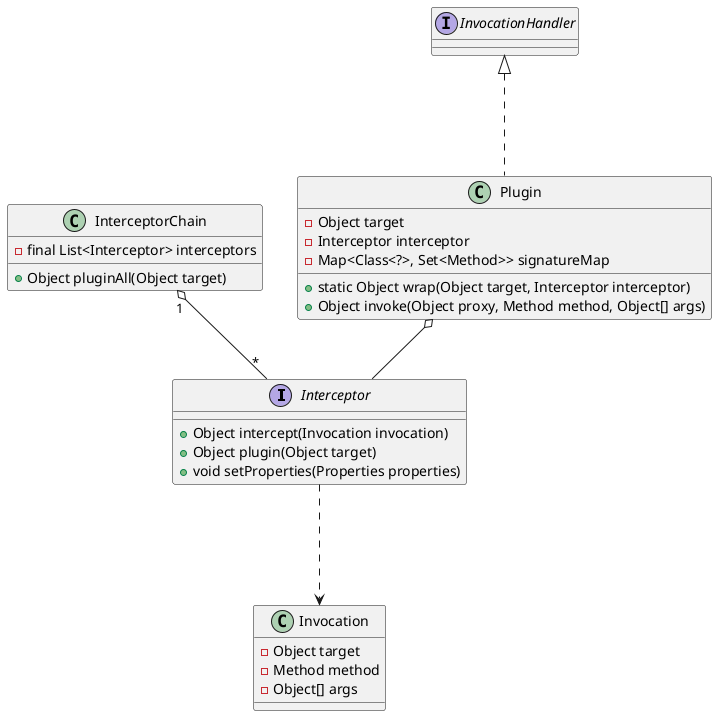

## package
org.apache.ibatis.plugin
```
    Interceptor
    InterceptorChain
    Intercepts
    Invocation
    Plugin
    PluginException
    Signature
```

## overview
* 拦截器
* 拦截器链
* 调用器 目标对象、方法、参数的封装
* 插件（增强） 生成动态代理，实现InvocationHandler

