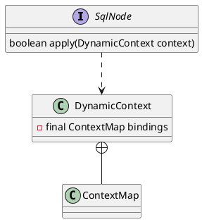

org.apache.ibatis.scripting.xmltags.TrimSqlNode

## package
```
SqlNode (org.apache.ibatis.scripting.xmltags)
    StaticTextSqlNode (org.apache.ibatis.scripting.xmltags)
    MixedSqlNode (org.apache.ibatis.scripting.xmltags)
    TextSqlNode (org.apache.ibatis.scripting.xmltags)
    ForEachSqlNode (org.apache.ibatis.scripting.xmltags)
    IfSqlNode (org.apache.ibatis.scripting.xmltags)
    VarDeclSqlNode (org.apache.ibatis.scripting.xmltags)
    TrimSqlNode (org.apache.ibatis.scripting.xmltags)
        WhereSqlNode (org.apache.ibatis.scripting.xmltags)
        SetSqlNode (org.apache.ibatis.scripting.xmltags)
    ChooseSqlNode (org.apache.ibatis.scripting.xmltags)
```

## define
