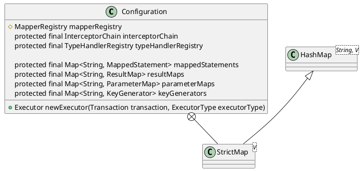

org.apache.ibatis.session.Configuration

## define

```plantuml
@startuml

class Configuration {
    # MapperRegistry mapperRegistry
    protected final InterceptorChain interceptorChain
    protected final TypeHandlerRegistry typeHandlerRegistry
    
    protected final Map<String, MappedStatement> mappedStatements
    protected final Map<String, ResultMap> resultMaps
    protected final Map<String, ParameterMap> parameterMaps
    protected final Map<String, KeyGenerator> keyGenerators
    
    + Executor newExecutor(Transaction transaction, ExecutorType executorType)
}

class HashMap<String, V>
class StrictMap<V> {
}

HashMap <|-- StrictMap 
Configuration +-- StrictMap

@enduml
```