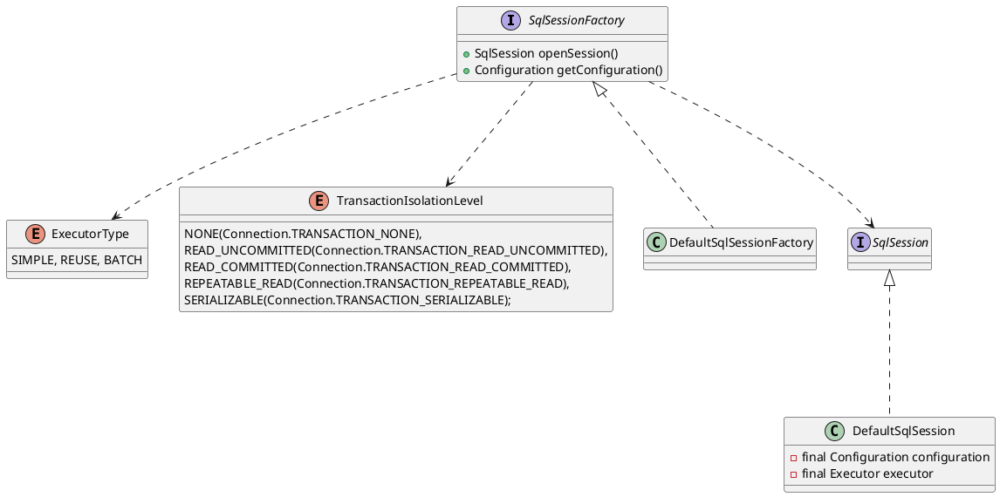

## package
```
defaults
    DefaultSqlSession
    DefaultSqlSessionFactory
AutoMappingBehavior
AutoMappingUnknownColumnBehavior
Configuration
ExecutorType
LocalCacheScope
ResultContext
ResultHandler
RowBounds
SqlSession
SqlSessionException
SqlSessionFactory
SqlSessionFactoryBuilder
SqlSessionManager
TransactionIsolationLevel
```

## overview

