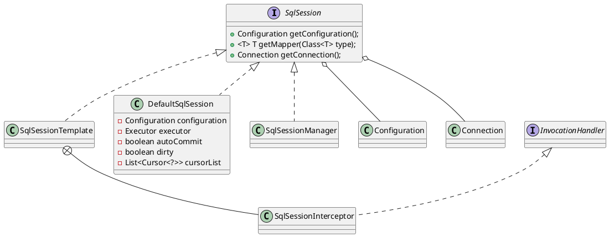

org.apache.ibatis.session.SqlSession

## hierarchy
```
SqlSession (org.apache.ibatis.session)
    SqlSessionManager (org.apache.ibatis.session)
    SqlSessionTemplate (org.mybatis.spring)
    DefaultSqlSession (org.apache.ibatis.session.defaults)
```

## define



## methods
* selectOne
* selectList
* selectMap
* selectCursor
* select
* insert
* update
* delete
* commit
* rollback
* flushStatements
* getConfiguration
* getMapper
* getConnection