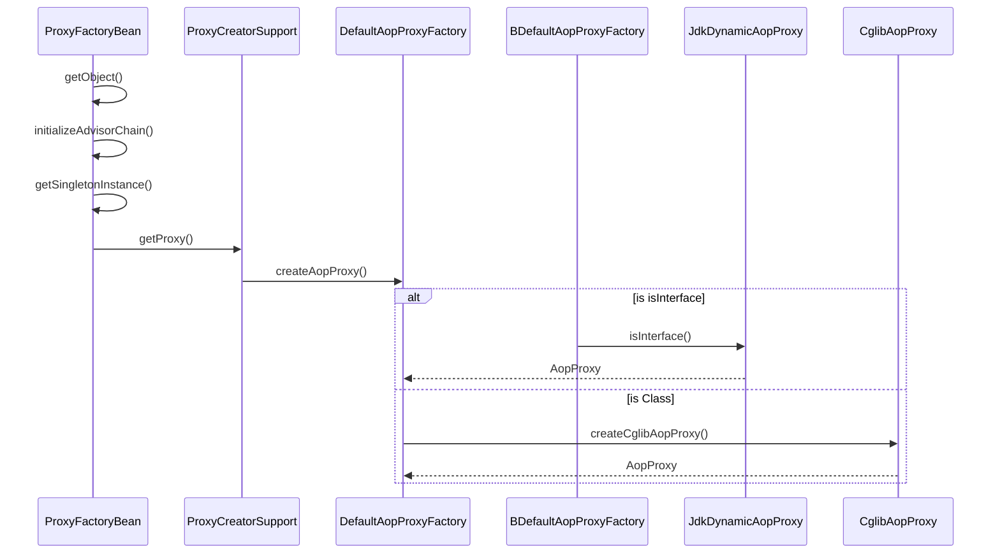

org.springframework.aop.framework.ProxyFactoryBean

```
ProxyFactoryBean
    ProxyCreatorSupport
        AdvisedSupport
            ProxyConfig
```

#### 继承

```yuml
// {type:class}
[ProxyConfig]^-[AdvisedSupport]
[AdvisedSupport]^-[ProxyCreatorSupport]
[ProxyCreatorSupport]^-[ProxyFactoryBean]
```

#### 生成AOP代理
