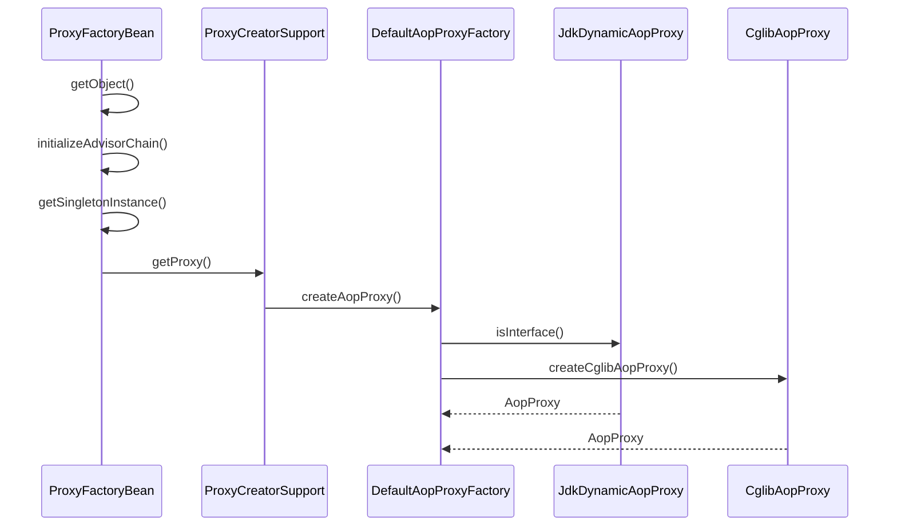

org.springframework.aop.framework.ProxyFactoryBean

```
ProxyFactoryBean
    ProxyCreatorSupport
        AdvisedSupport
            ProxyConfig
```



```mermaid
sequenceDiagram
    %% 实现FactoryBean，实例化通知链
    ProxyFactoryBean ->> ProxyFactoryBean: getObject()
    ProxyFactoryBean ->> ProxyFactoryBean: initializeAdvisorChain()
    ProxyFactoryBean ->> ProxyFactoryBean: getSingletonInstance()

    %% 创建代理对象
    ProxyFactoryBean ->> ProxyCreatorSupport: getProxy()
    ProxyCreatorSupport ->> DefaultAopProxyFactory: createAopProxy()

    %% Jdk或者Cglib创建代理对象
    DefaultAopProxyFactory ->> JdkDynamicAopProxy: isInterface()
    DefaultAopProxyFactory ->> CglibAopProxy: createCglibAopProxy()

    JdkDynamicAopProxy -->> DefaultAopProxyFactory: AopProxy
    CglibAopProxy -->> DefaultAopProxyFactory: AopProxy
```