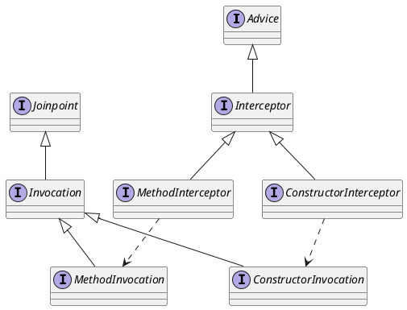

org.aopalliance.aop

## define
```
aop
    Advice
    AspectException
intercept
    ConstructorInterceptor
    ConstructorInvocation
    Interceptor
    Invocation
    Joinpoint
    MethodInterceptor
    MethodInvocation
```

## overview
