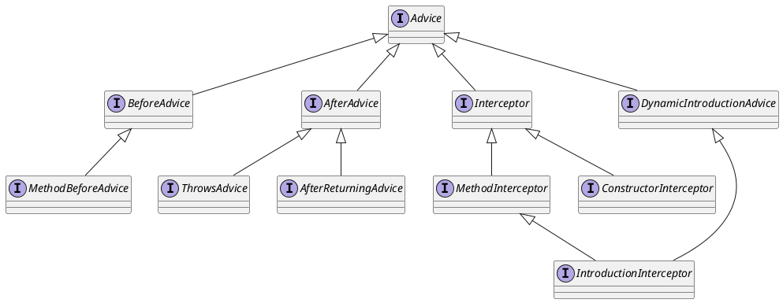

org.aopalliance.aop.Advice

## 1. Advice 定义
在特定的连接点，AOP框架执行的动作。

* 前置通知 BeforeAdvice MethodBeforeAdvice
* 后置通知、异常通知、环绕通知
* 动态织入通知 织入拦截器
* 通知理解为拦截，拦截器继承了通知，有构造方法拦截器、普通方法拦截器



## 2. Advice 类图

```yuml
// {type:class}

[Advice]
[BeforeAdvice{bg:thistle}]
[AfterAdvice{bg:whitesmoke}]
[DynamicIntroductionAdvice{bg:wheat}]
[Interceptor{bg:tomato}]

// 1. before通知 方法前通知
[Advice]^-[BeforeAdvice]
[BeforeAdvice]^-[MethodBeforeAdvice]

// 2. after通知 异常、返回通知
[Advice]^-[AfterAdvice]
[AfterAdvice]^-[ThrowsAdvice]
[AfterAdvice]^-[AfterReturningAdvice]

// 3. interceptor 拦截器
[Advice]^-[Interceptor]
[Interceptor]^-[MethodInterceptor]
[Interceptor]^-[ConstructorInterceptor]

// 4. 动态织通知 织入拦截器
[Advice]^-[DynamicIntroductionAdvice]
[DynamicIntroductionAdvice]^-[IntroductionInterceptor]

// 注释
[note:定义在连接点做什么，为切面增强提供织入接口{bg:cornsilk}]
[Interceptor]-.-[note:通知是对拦截器更高级别的抽象{bg:cornsilk}]
```