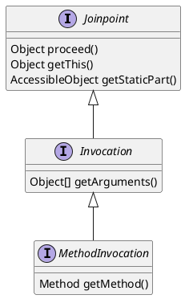

org.aopalliance.intercept.Joinpoint

## 1. Joinpoint 定义
1. JoinPoint对象封装了SpringAop中切面方法的信息,在切面方法中添加JoinPoint参数,就可以获取到封装了该方法信息的JoinPoint对象.
2. 被拦截到的点，因为Spring只支持方法类型的连接点，所以在Spring中连接点指的就是被拦截到的方法，实际上连接点还可以是字段或者构造器


## hierachy
* Joinpoint
* Invocation
* MethodInvocation



## 2. Joinpoint类图
* spring 实现了方法级别的拦截
* org.springframework.aop.ProxyMethodInvocation
* org.springframework.aop.framework.ReflectiveMethodInvocation

```yuml
// {type:class}

[Joinpoint{bg:thistle}]
[MethodInvocation{bg:thistle}]
[ReflectiveMethodInvocation{bg:tomato}]

// 1. 连接点
[Joinpoint]^-[Invocation]
[Invocation]-.-[note:调用器是一个连接点，可被拦截器拦截{bg:cornsilk}]

// 2.1 构造方法调用器
[Invocation]^-[ConstructorInvocation]

// 2.2 普通方法调用器
[Invocation]^-[MethodInvocation]

// 2.2.1 代理的普通方法调用器
[MethodInvocation]^-[ProxyMethodInvocation]

// 2.2.2 反射的普通方法调用器 对连接点的实现
[ProxyMethodInvocation]^-.-[ReflectiveMethodInvocation]

// 2.2.3 cglib的普通方法调用器
[ReflectiveMethodInvocation]^-[CglibAopProxy$CglibMethodInvocation]

```


# org.aspectj.lang.JoinPoint

```yuml
// {type:class}

[Joinpoint{bg:thistle}]^-[ProceedingJoinPoint]

[ProceedingJoinPoint]^-.-[JoinPointImpl]
[ProceedingJoinPoint]^-.-[MethodInvocationProceedingJoinPoint{bg:tomato}]

```