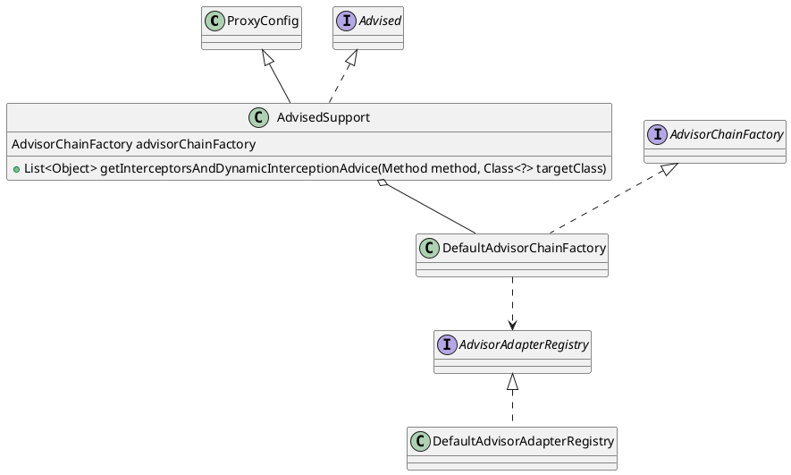

org.springframework.aop.framework.AdvisedSupport

## package
```
ProxyConfig (org.springframework.aop.framework)
    AdvisedSupport (org.springframework.aop.framework)
        ProxyCreatorSupport (org.springframework.aop.framework)
            ProxyFactoryBean (org.springframework.aop.framework)
            ProxyFactory (org.springframework.aop.framework)
            AspectJProxyFactory (org.springframework.aop.aspectj.annotation)
```

## define


