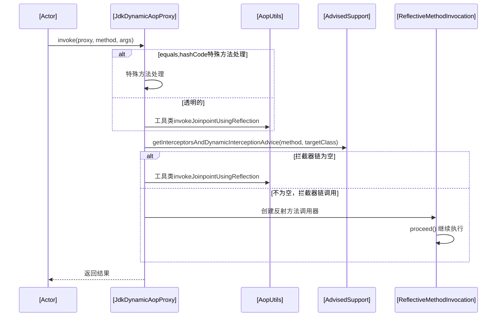
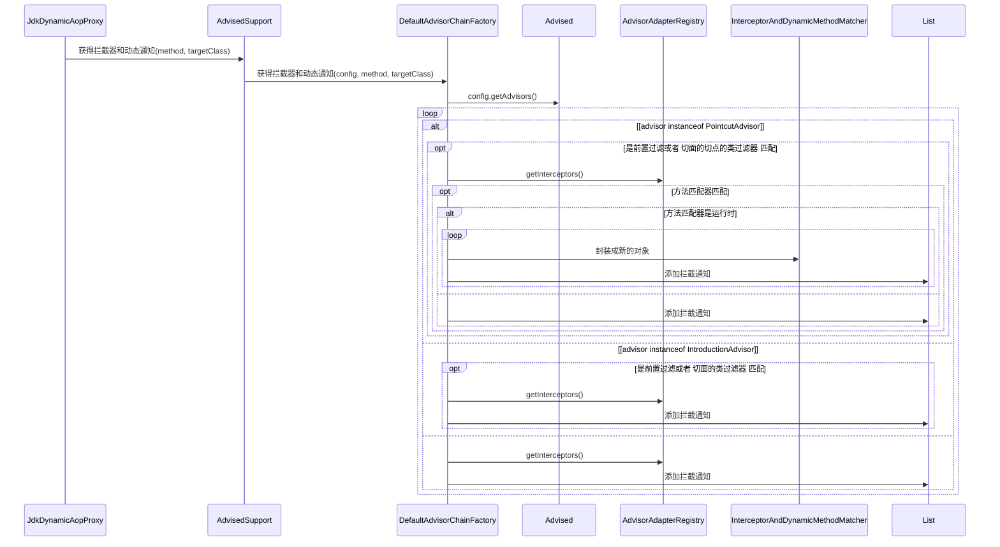

# AopProxy

## 1. AopProxy 定义
```java
public interface AopProxy {
	Object getProxy();
	Object getProxy(ClassLoader classLoader);
}
```

## hierachy

```
AopProxy (org.springframework.aop.framework)
    JdkDynamicAopProxy (org.springframework.aop.framework)
    CglibAopProxy (org.springframework.aop.framework)
        ObjenesisCglibAopProxy (org.springframework.aop.framework)
```

## 2. AopProxy 类图
```yuml
// {type:class}

[AopProxy]
[JdkDynamicAopProxy]
[CglibAopProxy]

// 1. jdk实现代理
[AopProxy]^-.-[JdkDynamicAopProxy]
[InvocationHandler]^-.-[JdkDynamicAopProxy]
[JdkDynamicAopProxy]++-.-[AdvisedSupport]

// 2. cglib实现代理
[AopProxy]^-.-[CglibAopProxy]
[CglibAopProxy]++-.-[AdvisedSupport]

// 已通知的支持
[ProxyConfig]^-[AdvisedSupport]
[Advised]^-.-[AdvisedSupport]
[TargetClassAware]^-[Advised]
```
## 3. 动态代理实现：jdk与cglib

### 3.1 JdkDynamicAopProxy
org.springframework.aop.framework.JdkDynamicAopProxy

Proxy.newProxyInstance(ClassLoader loader, Class<?>[] interfaces, InvocationHandler h)

#### jdk动态代理类图
```yuml
// {type:class}

// 代理类对应目标类方法的实现
// super.h.invoke(this, m3, (Object[])null)

// 代理类继承Proxy
[Proxy]^-[$ProxyXXX]

// Proxy持有调用处理器
[Proxy]++-[InvocationHandler]

// 代理类的方法
[$ProxyXXX]++1-*[Method]

```

#### JdkDynamicAopProxy调用



### 3.2 CglibAopProxy
org.springframework.aop.framework.CglibAopProxy

#### CglibMethodInvocation
org.springframework.aop.framework.CglibAopProxy.CglibMethodInvocation

DynamicAdvisedInterceptor

#### ObjenesisCglibAopProxy

## 4. 获得拦截器链

### 4.1 生成拦截器链
List<Object> chain = this.advised.getInterceptorsAndDynamicInterceptionAdvice(method, targetClass);


### 4.2 AdvisorChainFactory类图
```yuml
// {type:class}

[AdvisorChainFactory]^-.-[DefaultAdvisorChainFactory]
[AdvisorChainFactory]uses-.->[Advised]

// 已通知的切面，包含很多通知器（切面）
[Advised]++-[Advisor]

// Advisor通知器（aop切面），持有通知（在何时）和切点（在哪里）
[Advisor]++-[Advice]
[Advisor]^-[PointcutAdvisor]
[PointcutAdvisor]++-[Pointcut]

// 默认切面拦截器链工厂
[DefaultAdvisorChainFactory]uses-.->[GlobalAdvisorAdapterRegistry]
[DefaultAdvisorChainFactory]uses-.->[GlobalAdvisorAdapterRegistry]

// 单例 全局切面适配注册表
[GlobalAdvisorAdapterRegistry]++-[AdvisorAdapterRegistry]
[AdvisorAdapterRegistry]^-.-[DefaultAdvisorAdapterRegistry]

[DefaultAdvisorAdapterRegistry]++-[AdvisorAdapter]

```

### 4.3 AdvisorAdapter适配器

```yuml
// {type:class}

[AdvisorAdapter||+supportsAdvice(Advice);+getInterceptor(Advisor)]

// 3个实现 方法执行之前、抛出异常时、返回时
[AdvisorAdapter]^-.-[MethodBeforeAdviceAdapter]
[MethodBeforeAdviceAdapter]uses-.->[MethodBeforeAdviceInterceptor]

[AdvisorAdapter]^-.-[ThrowsAdviceAdapter]
[ThrowsAdviceAdapter]uses-.->[ThrowsAdviceInterceptor]

[AdvisorAdapter]^-.-[AfterReturningAdviceAdapter]
[AfterReturningAdviceAdapter]uses-.->[AfterReturningAdviceInterceptor]

// 方法依赖
[AdvisorAdapter]uses-.->[Advice]
[AdvisorAdapter]uses-.->[Advisor]

// Advice Interceptor MethodInterceptor
[MethodInterceptor]^-.-[MethodBeforeAdviceInterceptor]
[MethodInterceptor]^-.-[ThrowsAdviceAdapter]
[MethodInterceptor]^-.-[AfterReturningAdviceInterceptor]
```

## 5. 反射方法调用器
