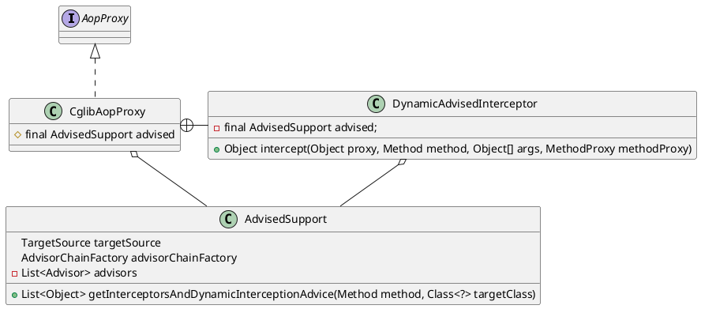

## define

```plantuml
@startuml

interface AopProxy
class CglibAopProxy {
    # final AdvisedSupport advised
    
}
AopProxy <|.. CglibAopProxy

' 通知支撑
class AdvisedSupport {
    TargetSource targetSource
    AdvisorChainFactory advisorChainFactory
    - List<Advisor> advisors
    
    + List<Object> getInterceptorsAndDynamicInterceptionAdvice(Method method, Class<?> targetClass)
}
CglibAopProxy o-- AdvisedSupport


' 内部类
class DynamicAdvisedInterceptor {
    - final AdvisedSupport advised;
    + Object intercept(Object proxy, Method method, Object[] args, MethodProxy methodProxy)
} 
CglibAopProxy +- DynamicAdvisedInterceptor
DynamicAdvisedInterceptor o-- AdvisedSupport

@enduml
```

## DynamicAdvisedInterceptor.intercept()
* 获得拦截器链
    - 拦截器链为空，直接调用
    - 拦截器链不为空，执行拦截器链
* 结果处理、返回