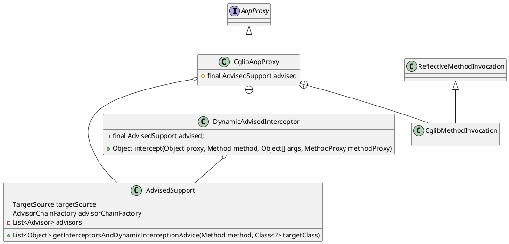

org.springframework.aop.framework.CglibAopProxy

## hierarchy
```
CglibAopProxy (org.springframework.aop.framework)
    ObjenesisCglibAopProxy (org.springframework.aop.framework)
```

## define
* 内部类
  * DynamicAdvisedInterceptor
  * CglibMethodInvocation




## DynamicAdvisedInterceptor.intercept()
* 获得拦截器链 advised.getInterceptorsAndDynamicInterceptionAdvice(method, targetClass)
    - 拦截器链为空，直接调用
    - 拦截器链不为空，执行拦截器链
* 结果处理、返回