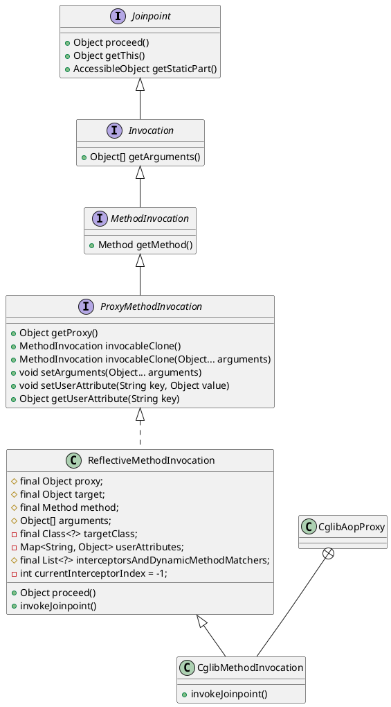

org.springframework.aop.framework.ReflectiveMethodInvocation

## hierachy
```
Joinpoint (org.aopalliance.intercept)
    Invocation (org.aopalliance.intercept)
        ConstructorInvocation (org.aopalliance.intercept)
        MethodInvocation (org.aopalliance.intercept)
            ProxyMethodInvocation (org.springframework.aop)
                ReflectiveMethodInvocation (org.springframework.aop.framework)
                    CglibMethodInvocation in CglibAopProxy (org.springframework.aop.framework)
```

## define
* 反射的方法调用器

