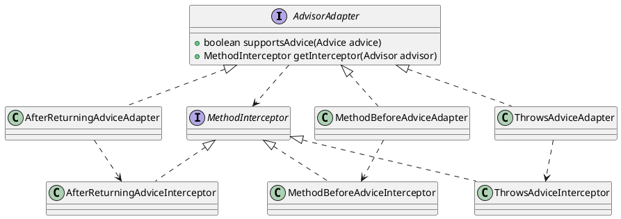

org.springframework.aop.framework.adapter.AdvisorAdapter

## hierarchy
* 前置通知
* 抛出通知
* 后置返回通知

```
AdvisorAdapter (org.springframework.aop.framework.adapter)
    MethodBeforeAdviceAdapter (org.springframework.aop.framework.adapter)
    ThrowsAdviceAdapter (org.springframework.aop.framework.adapter)
    AfterReturningAdviceAdapter (org.springframework.aop.framework.adapter)
```

## define
将一个类的接口转换成客户希望的另外一个接口。适配器模式使得原本由于接口不兼容而不能一起工作的那些类可以一起工作。

