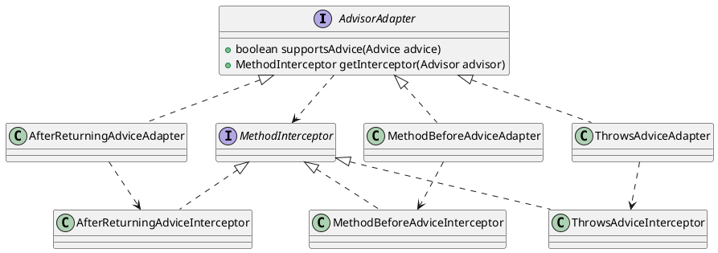

org.springframework.aop.framework.adapter.AdvisorAdapter

## hierarchy
```
AdvisorAdapter (org.springframework.aop.framework.adapter)
    MethodBeforeAdviceAdapter (org.springframework.aop.framework.adapter)
    ThrowsAdviceAdapter (org.springframework.aop.framework.adapter)
    AfterReturningAdviceAdapter (org.springframework.aop.framework.adapter)
```

## define

