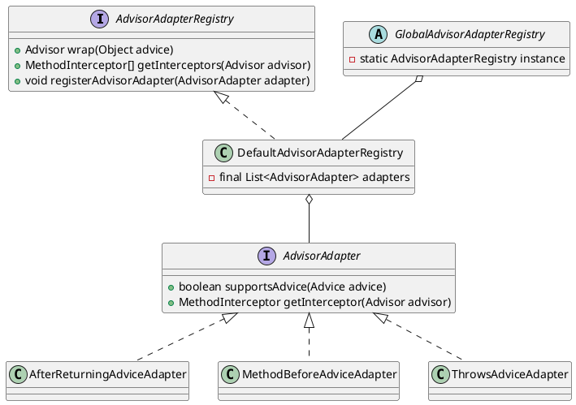

org.springframework.aop.framework.adapter.AdvisorAdapterRegistry

## hierarchy
```
AdvisorAdapterRegistry (org.springframework.aop.framework.adapter)
    DefaultAdvisorAdapterRegistry (org.springframework.aop.framework.adapter)
```

## define
