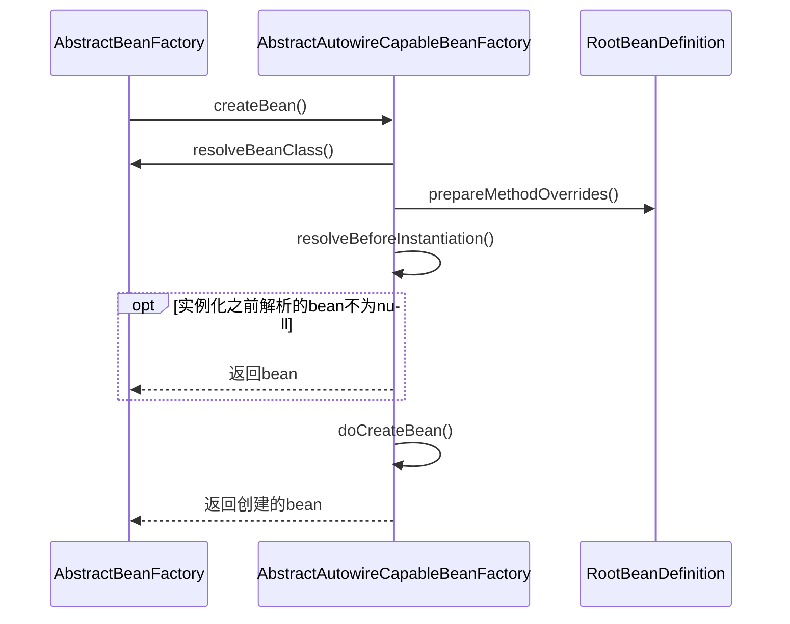
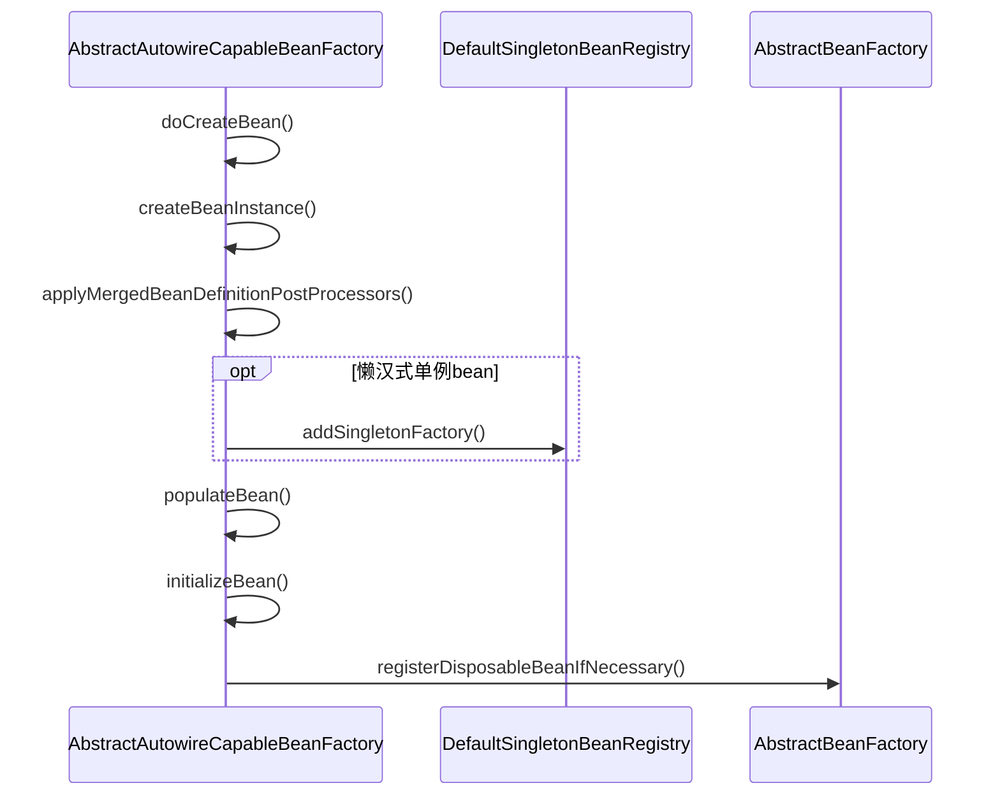
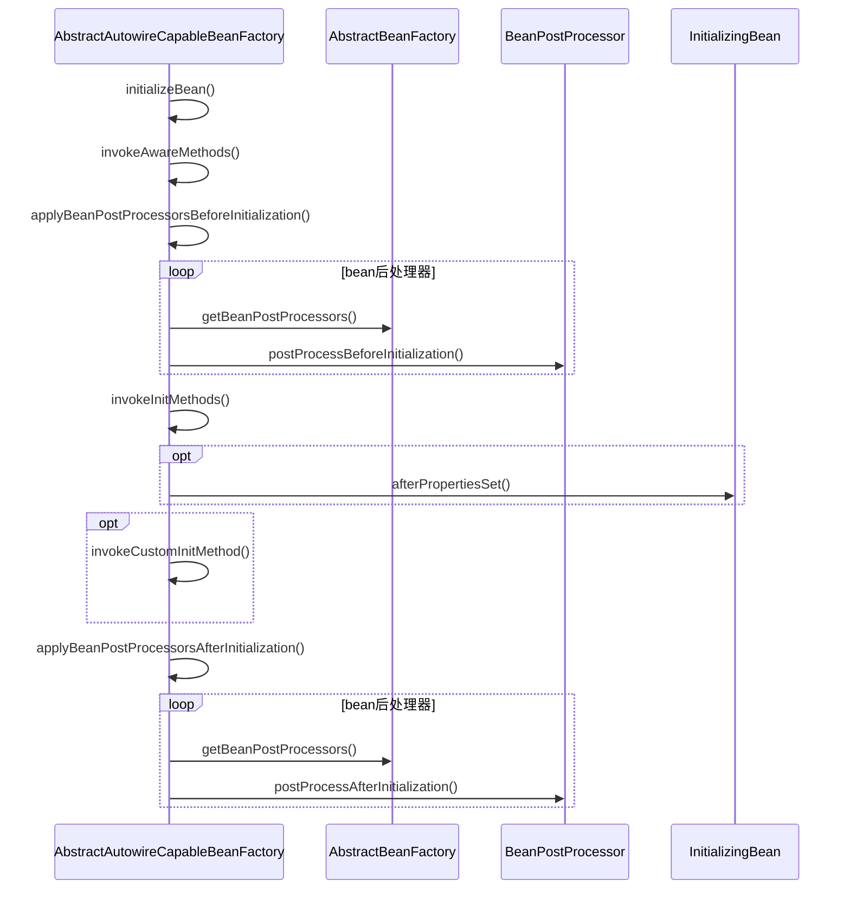

org.springframework.beans.factory.support.AbstractAutowireCapableBeanFactory

## createBean()
* resolveBeanClass
* prepareMethodOverrides
* resolveBeforeInstantiation
* doCreateBean

## doCreateBean()
* 实例化 createBeanInstance
* 填充属性 populateBean
* 初始化 initializeBean
    - 调用感知方法 invokeAwareMethods
    - 应用后处理器初始化之前方法 applyBeanPostProcessorsBeforeInitialization 循环遍历 postProcessBeforeInitialization
    - 初始化中的bean InitializingBean.afterPropertiesSet()
    - 调用自定义初始化方法 invokeCustomInitMethod
    - 应用后处理器初始化之前方法 applyBeanPostProcessorsAfterInitialization 循环遍历 postProcessAfterInitialization
* 注册销毁接口 registerDisposableBeanIfNecessary

## initializeBean()
* invokeAwareMethods
* applyBeanPostProcessorsBeforeInitialization
* afterPropertiesSet
* invokeCustomInitMethod
* applyBeanPostProcessorsAfterInitialization

