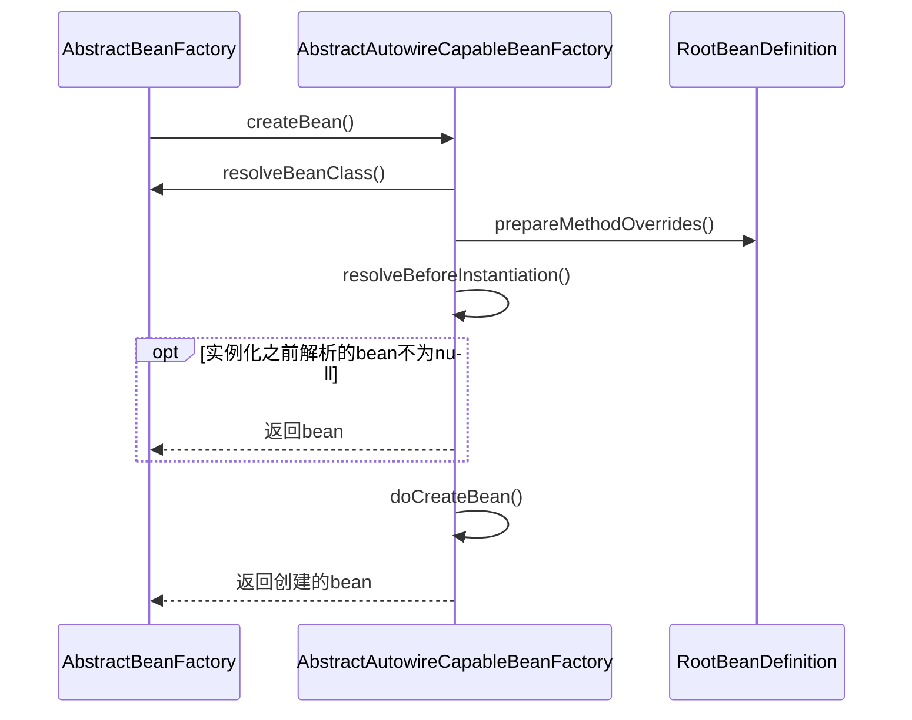
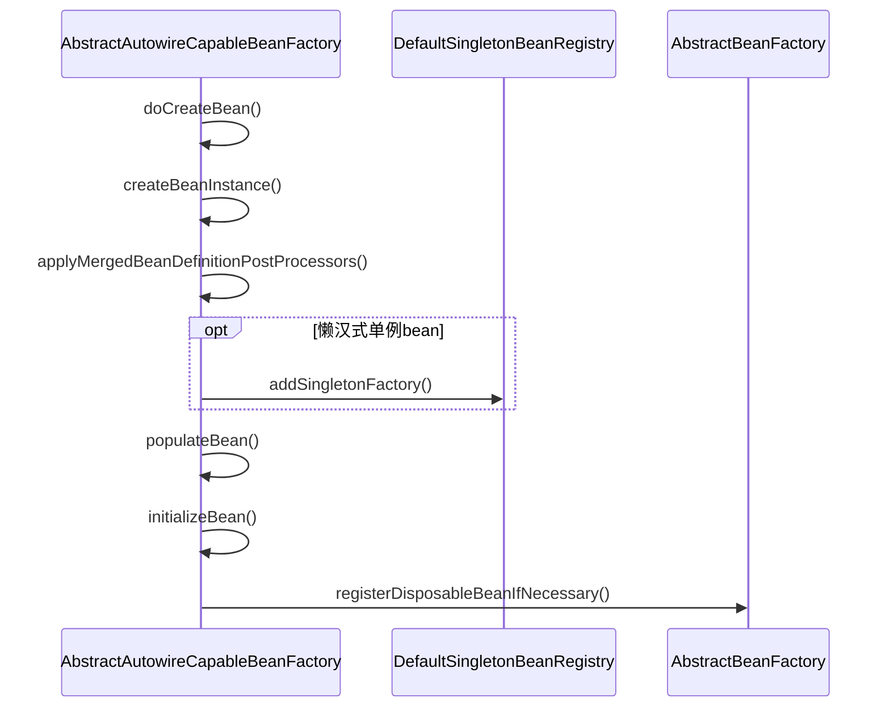
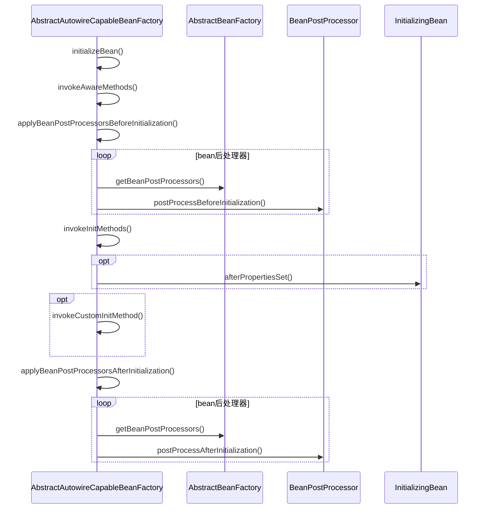

org.springframework.beans.factory.support.AbstractAutowireCapableBeanFactory

## createBean()

```mermaid
sequenceDiagram

    AbstractBeanFactory->>AbstractAutowireCapableBeanFactory:createBean()
    
    %% 解析
    AbstractAutowireCapableBeanFactory->>AbstractBeanFactory:resolveBeanClass()
    
    %% 准备方法重写
    AbstractAutowireCapableBeanFactory->>RootBeanDefinition:prepareMethodOverrides()
    
    %% 实例化之前的解析
    AbstractAutowireCapableBeanFactory->>AbstractAutowireCapableBeanFactory:resolveBeforeInstantiation()
    opt 实例化之前解析的bean不为null
        AbstractAutowireCapableBeanFactory-->>AbstractBeanFactory:返回bean
    end
    
    %% 创建
    AbstractAutowireCapableBeanFactory->>AbstractAutowireCapableBeanFactory:doCreateBean()
    
    AbstractAutowireCapableBeanFactory-->>AbstractBeanFactory:返回创建的bean
```
## doCreateBean()

```mermaid
sequenceDiagram
    AbstractAutowireCapableBeanFactory->>AbstractAutowireCapableBeanFactory:doCreateBean()
    
    %% 实例化
    AbstractAutowireCapableBeanFactory->>AbstractAutowireCapableBeanFactory:createBeanInstance()    
    
    %% 后处理
    AbstractAutowireCapableBeanFactory->>AbstractAutowireCapableBeanFactory:applyMergedBeanDefinitionPostProcessors()    
    
    opt 懒汉式单例bean
        AbstractAutowireCapableBeanFactory->>DefaultSingletonBeanRegistry:addSingletonFactory()    
    end
    
    %% 填充属性
    AbstractAutowireCapableBeanFactory->>AbstractAutowireCapableBeanFactory:populateBean()    
    
    %% 初始化
    AbstractAutowireCapableBeanFactory->>AbstractAutowireCapableBeanFactory:initializeBean()    
    
    %% 注册销毁接口
    AbstractAutowireCapableBeanFactory->>AbstractBeanFactory:registerDisposableBeanIfNecessary()
```

## initializeBean()

```mermaid
sequenceDiagram
    AbstractAutowireCapableBeanFactory->>AbstractAutowireCapableBeanFactory:initializeBean()  
    
    %% 感知方法 BeanNameAware BeanClassLoaderAware BeanFactoryAware
    AbstractAutowireCapableBeanFactory->>AbstractAutowireCapableBeanFactory:invokeAwareMethods()  
    
    %% 初始化之前
    AbstractAutowireCapableBeanFactory->>AbstractAutowireCapableBeanFactory:applyBeanPostProcessorsBeforeInitialization()  
    loop bean后处理器
        AbstractAutowireCapableBeanFactory->>AbstractBeanFactory:getBeanPostProcessors()  
        AbstractAutowireCapableBeanFactory->>BeanPostProcessor:postProcessBeforeInitialization() 
    end
    
    %% 初始化
    AbstractAutowireCapableBeanFactory->>AbstractAutowireCapableBeanFactory:invokeInitMethods()  
    opt
        AbstractAutowireCapableBeanFactory->>InitializingBean:afterPropertiesSet()  
    end
    opt
        AbstractAutowireCapableBeanFactory->>AbstractAutowireCapableBeanFactory:invokeCustomInitMethod()  
    end
    
    %% 初始化之后
    AbstractAutowireCapableBeanFactory->>AbstractAutowireCapableBeanFactory:applyBeanPostProcessorsAfterInitialization()  
    loop bean后处理器
        AbstractAutowireCapableBeanFactory->>AbstractBeanFactory:getBeanPostProcessors()  
        AbstractAutowireCapableBeanFactory->>BeanPostProcessor:postProcessAfterInitialization() 
    end
```
