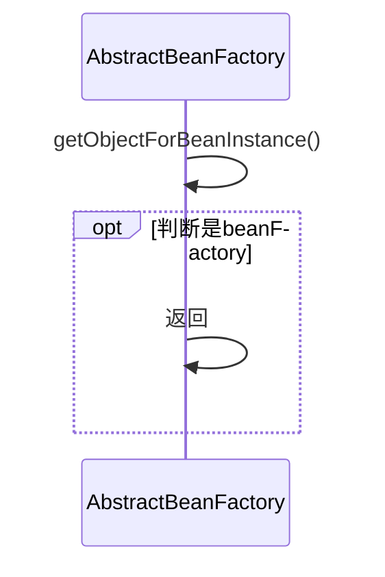
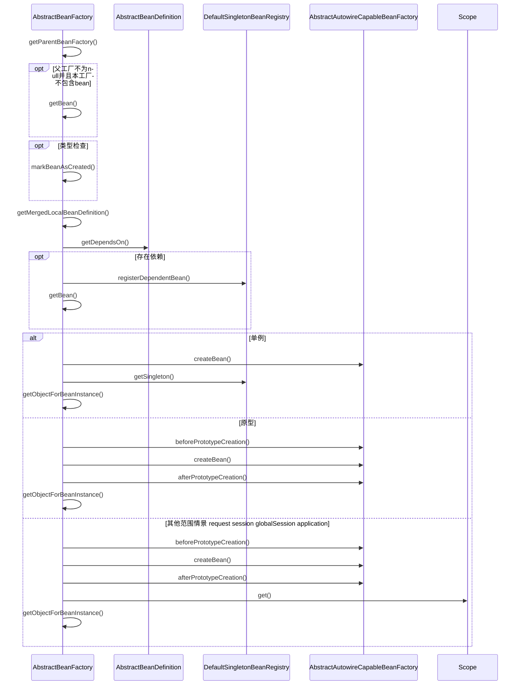

org.springframework.beans.factory.support.AbstractBeanFactory

## 1. 定义
```
SimpleAliasRegistry AliasRegistry
    DefaultSingletonBeanRegistry SingletonBeanRegistry
        FactoryBeanRegistrySupport
            AbstractBeanFactory ConfigurableBeanFactory
```

## 2. 依赖注入

### 2.1 getBean()
```mermaid
sequenceDiagram
    %% 1. 获取bean
    Actor ->> AbstractBeanFactory: getBean()
    AbstractBeanFactory ->> AbstractBeanFactory: doGetBean()
    
    %% 2. 名称处理
    AbstractBeanFactory ->> AbstractBeanFactory: transformedBeanName()
    AbstractBeanFactory ->> SimpleAliasRegistry: canonicalName()
    
    %% 3. 单例
    AbstractBeanFactory ->> DefaultSingletonBeanRegistry: getSingleton()
    
    %% 4. 创建
    alt 共享实例存在且参数为null
        AbstractBeanFactory ->> AbstractBeanFactory: 2.2 getObjectForBeanInstance()
    else
        AbstractBeanFactory ->> AbstractBeanFactory: 2.3 根据beanDefinition生成
    end
    
    %% 5. 后处理，返回
    opt 需要进行类型转换
        AbstractBeanFactory ->> TypeConverter: convertIfNecessary()
        AbstractBeanFactory ->> Actor: 生成完毕，返回bean
    end
    AbstractBeanFactory ->> Actor: 生成完毕，返回bean
```

### 2.2 getObjectForBeanInstance()


### 2.3 根据beanDefinition生成
* 父工厂加载
* 依赖注入 循环递归处理依赖
* 单例创建
* 原型创建



### 2.4 createBean()由子类自动装配工厂（AbstractAutowireCapableBeanFactory）实现
