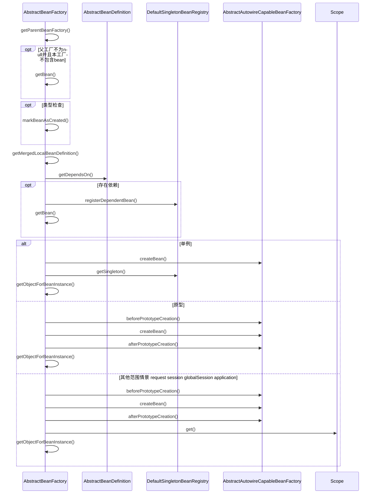
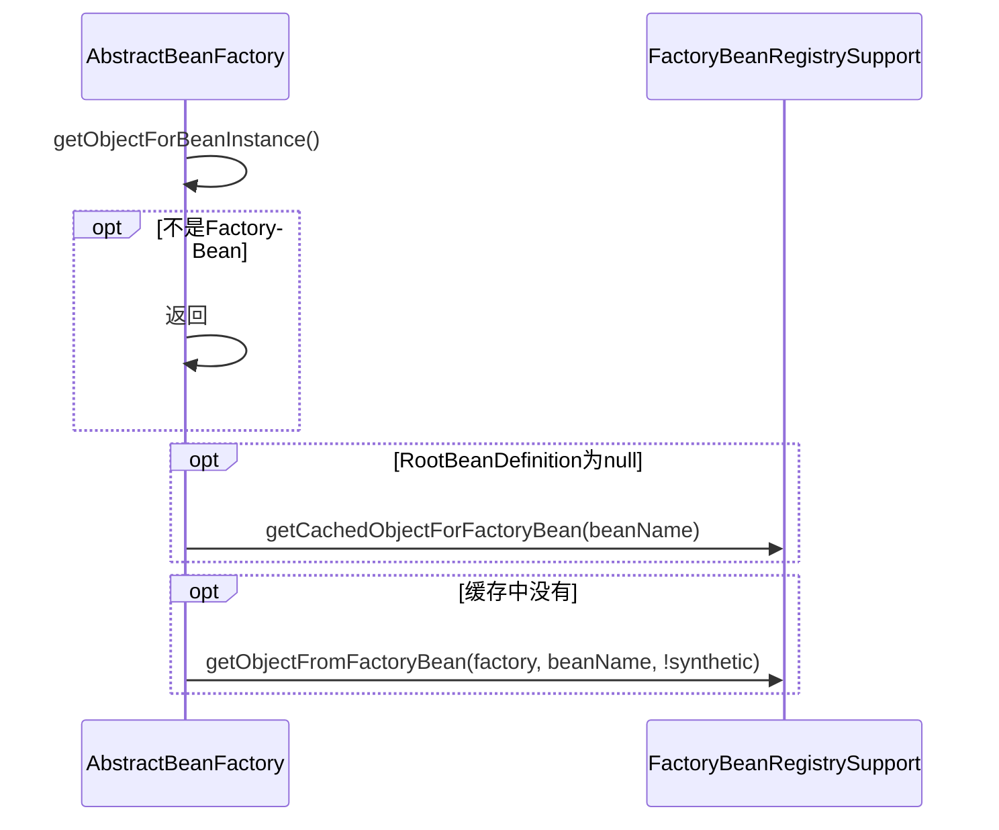

org.springframework.beans.factory.support.AbstractBeanFactory

## 1. 定义
```
SimpleAliasRegistry (org.springframework.core) AliasRegistry
    DefaultSingletonBeanRegistry (org.springframework.beans.factory.support) SingletonBeanRegistry
        FactoryBeanRegistrySupport (org.springframework.beans.factory.support)
            AbstractBeanFactory (org.springframework.beans.factory.support) AbstractBeanFactory 
```

```java
public class SimpleAliasRegistry implements AliasRegistry {
	/** Map from alias to canonical name */
	private final Map<String, String> aliasMap = new ConcurrentHashMap<String, String>(16);
}
public class DefaultSingletonBeanRegistry extends SimpleAliasRegistry implements SingletonBeanRegistry {
    /** Cache of singleton objects: bean name --> bean instance */
    private final Map<String, Object> singletonObjects = new ConcurrentHashMap<String, Object>(256);
}

public abstract class FactoryBeanRegistrySupport extends DefaultSingletonBeanRegistry {
	/** Cache of singleton objects created by FactoryBeans: FactoryBean name --> object */
	private final Map<String, Object> factoryBeanObjectCache = new ConcurrentHashMap<String, Object>(16);
}
public abstract class AbstractBeanFactory extends FactoryBeanRegistrySupport implements ConfigurableBeanFactory {
	/** Parent bean factory, for bean inheritance support */
	private BeanFactory parentBeanFactory;
	/** Spring ConversionService to use instead of PropertyEditors */
    private ConversionService conversionService;
    /** A custom TypeConverter to use, overriding the default PropertyEditor mechanism */
    private TypeConverter typeConverter;
    /** BeanPostProcessors to apply in createBean */
    private final List<BeanPostProcessor> beanPostProcessors = new ArrayList<BeanPostProcessor>();
    /** Map from bean name to merged RootBeanDefinition */
    private final Map<String, RootBeanDefinition> mergedBeanDefinitions =
            new ConcurrentHashMap<String, RootBeanDefinition>(256);
}
```

## 2. 依赖注入 Dependency Injection
* transformedBeanName()
* getSingleton getPrototypeBean() 单例、原型等获取bean
* ParentBeanFactory.getBean() 双亲上下文获取bean
* registerDependentBean() 解析依赖
* createBean() 模板方法 beforePrototypeCreation() afterPrototypeCreation()
    - [AbstractAutowireCapableBeanFactory.createBean()](./AbstractAutowireCapableBeanFactory.md)
* TypeConverter.convertIfNecessary()

### 2.1 getBean() doGetBean()
```mermaid
sequenceDiagram
    %% 1. 获取bean
    Actor ->> AbstractBeanFactory: getBean()
    AbstractBeanFactory ->> AbstractBeanFactory: doGetBean()
    
    %% 2. 名称处理
    AbstractBeanFactory ->> AbstractBeanFactory: transformedBeanName()
    AbstractBeanFactory ->> SimpleAliasRegistry: canonicalName()
    
    %% 3. 单例
    AbstractBeanFactory ->> DefaultSingletonBeanRegistry: getSingleton()
    
    %% 4. 创建
    alt 共享实例存在且参数为null
        AbstractBeanFactory ->> AbstractBeanFactory: 2.2 getObjectForBeanInstance()
    else
        AbstractBeanFactory ->> AbstractBeanFactory: 2.3 根据beanDefinition生成
    end
    
    %% 5. 后处理，返回
    opt 需要进行类型转换
        AbstractBeanFactory ->> TypeConverter: convertIfNecessary()
        AbstractBeanFactory ->> Actor: 生成完毕，返回bean
    end
    AbstractBeanFactory ->> Actor: 生成完毕，返回bean
```

### 2.3 根据beanDefinition生成
* 父工厂加载 双亲上下文加载
* 依赖注入 循环递归处理依赖
* 作用域
    - 单例创建
    - 原型创建
    - 其他范围创建
    



### 2.4 createBean()由子类自动装配工厂（AbstractAutowireCapableBeanFactory）实现
[AbstractAutowireCapableBeanFactory.createBean()](./AbstractAutowireCapableBeanFactory.md)

### 2.5 getObjectForBeanInstance()
FactoryBean的处理，factoryBean.getObject()获得工厂bean生成的bean，若获得工厂bean本身，#

