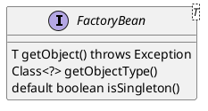

org.springframework.beans.factory.FactoryBean

## hierarchy

## define

```plantuml
@startuml

interface FactoryBean<T> {
	T getObject() throws Exception
	Class<?> getObjectType()
	default boolean isSingleton()
}

@enduml
```