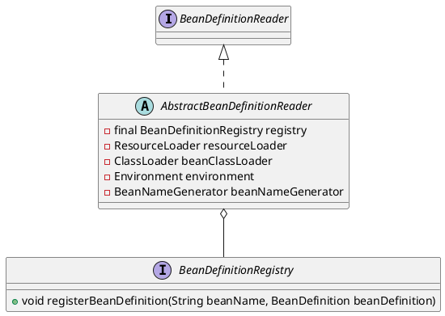

org.springframework.beans.factory.support.AbstractBeanDefinitionReader

## define

```plantuml
@startuml

interface BeanDefinitionReader

abstract class AbstractBeanDefinitionReader {
    - final BeanDefinitionRegistry registry
    - ResourceLoader resourceLoader
    - ClassLoader beanClassLoader
    - Environment environment
    - BeanNameGenerator beanNameGenerator
}
BeanDefinitionReader ^.. AbstractBeanDefinitionReader

interface BeanDefinitionRegistry {
    + void registerBeanDefinition(String beanName, BeanDefinition beanDefinition)
}
AbstractBeanDefinitionReader o-- BeanDefinitionRegistry

@enduml
```