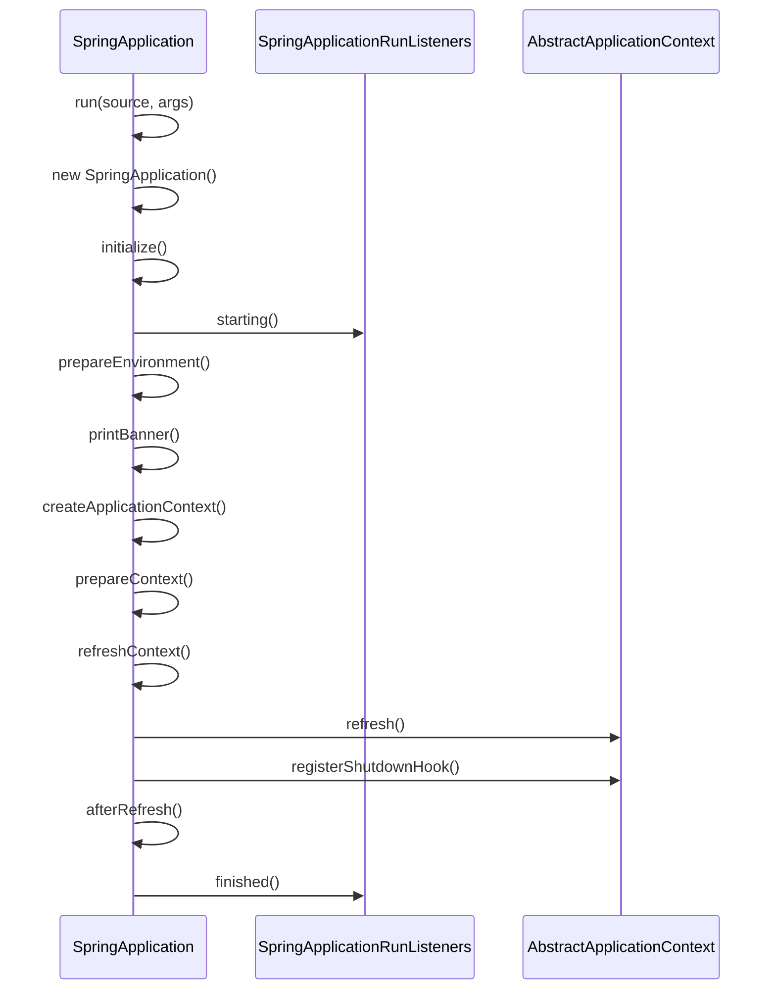

org.springframework.boot.SpringApplication

## 启动

```mermaid
sequenceDiagram
    SpringApplication->>SpringApplication:run(source, args)
    
    %% 1. 实例化，初始化Initializers、Listeners
    SpringApplication->>SpringApplication:new SpringApplication()
    SpringApplication->>SpringApplication:initialize()
    
    %% 2. 运行
    
    %% 2.1 监听器启动
    SpringApplication->>SpringApplicationRunListeners:starting()
    
    %% 2.2 准备环境、打印banner
    SpringApplication->>SpringApplication:prepareEnvironment();
    SpringApplication->>SpringApplication:printBanner()
    
    %% 2.3 上下文启动
    
    %% 2.3.1 上下文实例化、准备
    SpringApplication->>SpringApplication:createApplicationContext()
    SpringApplication->>SpringApplication:prepareContext()
    
    %% 2.3.2 刷新
    SpringApplication->>SpringApplication:refreshContext()
    SpringApplication->>AbstractApplicationContext:refresh()
    SpringApplication->>AbstractApplicationContext:registerShutdownHook()
    
    %% 2.3.2 刷新之后
    SpringApplication->>SpringApplication:afterRefresh()
    
    %% 2.4 监听器启动
    SpringApplication->>SpringApplicationRunListeners:finished()
```