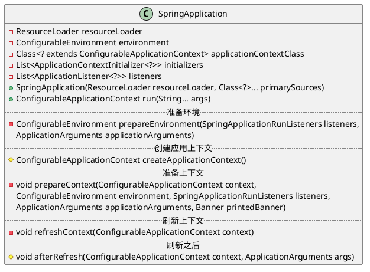
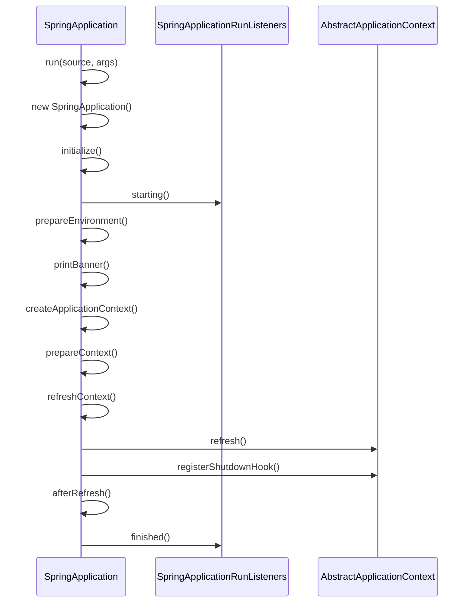

org.springframework.boot.SpringApplication

## class

## 启动
* initialize
* createApplicationContext
* prepareContext
* refreshContext
* afterRefresh
* listeners.finished

## context
* [AnnotationConfigEmbeddedWebApplicationContext](./context/embedded/AnnotationConfigEmbeddedWebApplicationContext.md)
* [AnnotationConfigServletWebServerApplicationContext](./web/servlet/ServletWebServerApplicationContext.md)
