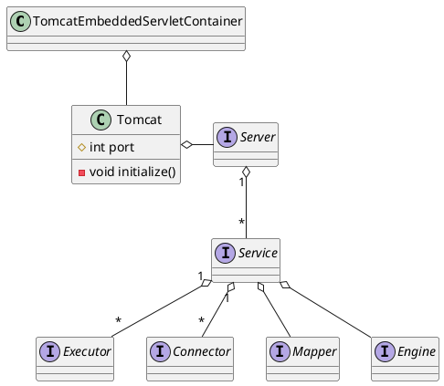

org.springframework.boot.context.embedded.tomcat.TomcatEmbeddedServletContainer

## define

```plantuml
@startuml

class TomcatEmbeddedServletContainer

TomcatEmbeddedServletContainer o-- Tomcat

class Tomcat {
    # int port
    - void initialize()
}
Tomcat o- Server

interface Server
interface Service
interface Executor
interface Connector
interface Mapper
interface Engine

Server  "1" o-- "*" Service
Service "1" o-- "*" Connector
Service "1" o-- "*" Executor
Service     o--     Mapper
Service     o--     Engine

@enduml
```