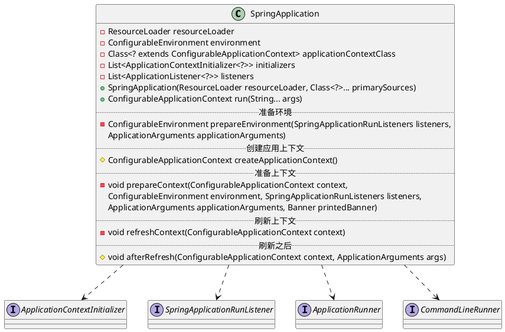
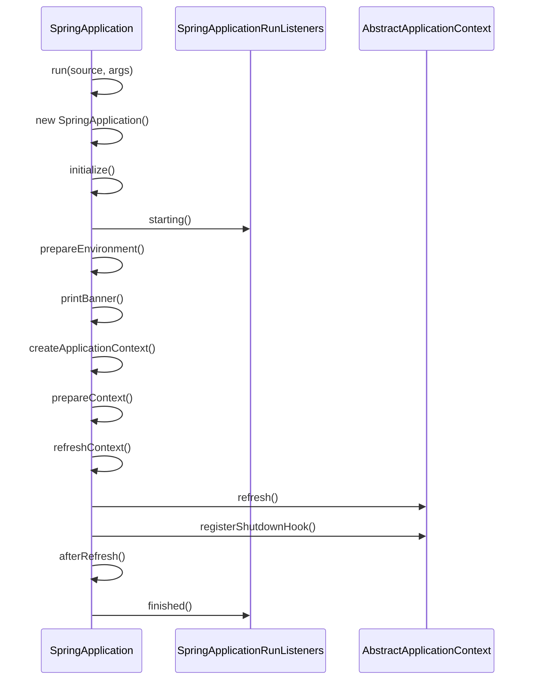

org.springframework.boot.SpringApplication

## define

## 启动
事件回调机制
* 配置在META-INF/spring.factories
  * ApplicationContextInitializer 
  * SpringApplicationRunListener
* 只需要放在ico容器中
  * ApplicationRunner 
  * CommandLineRunner

启动流程
* new SpringApplication(sources)
  * initialize
  * 保存主配置类
  * 推算当前是否一个web应用
  * 从类路径下找到`META-INF/spring.factories`配置的所有`ApplicationContextInitializer`；然后保存
  * 从类路径下找到`META-INF/spring.factories`配置的所有`ApplicationListener`
  * 从多个配置类中找到所有main方法的主配置类
* run(args)
  * 获取`SpringApplicationRunnerListeners`；从类路径下`META-INF/spring.factories`
  * 回调所有的获取`SpringApplicationRunnerListeners.starting()`方法
  * 获取命令行参数，准备环境
  * 创建环境完成后回调`SpringApplicationRunnerListeners.environmentPrepared()`表示环境准备完成
  * createApplicationContext 决定web的ioc还是普通的ioc
  * prepareContext 准备上下文
    * 将environment保存到ioc中；`applyInitializers`回调之前保存的所有的`ApplicationContextInitializer`
    * 回调`ApplicationListener`
    * 回调`SpringApplicationRunnerListeners.contextLoaded()`
  * refreshContext 刷新上下文，ioc容器初始化过程（如果是web应用还会创建嵌入式的Tomcat）
  * afterRefresh 从ioc容器中获取所有的`ApplicationRunner`和`CommandLineRunner`进行回调
  * listeners.finished 回调`SpringApplicationRunnerListeners.finished()`

## context
* [AnnotationConfigEmbeddedWebApplicationContext](./context/embedded/AnnotationConfigEmbeddedWebApplicationContext.md)
* [AnnotationConfigServletWebServerApplicationContext](./web/servlet/ServletWebServerApplicationContext.md)
