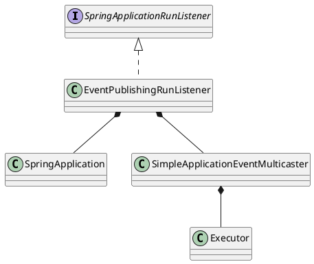

org.springframework.boot.SpringApplicationRunListener

## package
```
SpringApplicationRunListener (org.springframework.boot)
    EventPublishingRunListener (org.springframework.boot.context.event)
```

## define
```java
public interface SpringApplicationRunListener {
	void starting();
	void environmentPrepared(ConfigurableEnvironment environment);
	void contextPrepared(ConfigurableApplicationContext context);
	void contextLoaded(ConfigurableApplicationContext context);
	void started(ConfigurableApplicationContext context);
	void running(ConfigurableApplicationContext context);
	void failed(ConfigurableApplicationContext context, Throwable exception);
}
```

