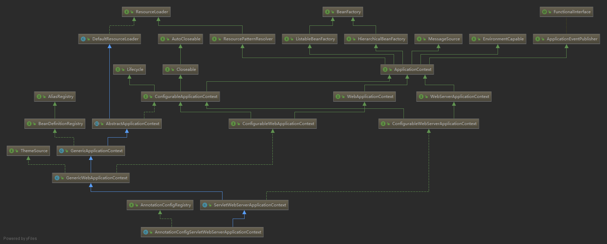

org.springframework.boot.web.servlet.context.AnnotationConfigServletWebServerApplicationContext

## hierarchy
```
DefaultResourceLoader (org.springframework.core.io)
    AbstractApplicationContext (org.springframework.context.support)
        GenericApplicationContext (org.springframework.context.support)
            GenericWebApplicationContext (org.springframework.web.context.support)
                ServletWebServerApplicationContext (org.springframework.boot.web.servlet.context)
                    AnnotationConfigServletWebServerApplicationContext (org.springframework.boot.web.servlet.context)
                    XmlServletWebServerApplicationContext (org.springframework.boot.web.servlet.context)
```
## class

```
@startuml

'''''''''''''''''''' 注解配置小服务程序web服务应用上下文 ''''''''''''''''''''
class AnnotationConfigServletWebServerApplicationContext {
    - final AnnotatedBeanDefinitionReader reader
    - final ClassPathBeanDefinitionScanner scanner
    - final Set<Class<?>> annotatedClasses
    - String[] basePackages
}

interface AnnotationConfigRegistry
AnnotationConfigRegistry <|.. AnnotationConfigServletWebServerApplicationContext
ServletWebServerApplicationContext <|-- AnnotationConfigServletWebServerApplicationContext

'''''''''''''''''''' 小服务程序web服务应用上下文 ''''''''''''''''''''
class ServletWebServerApplicationContext {
    - volatile WebServer webServer
    - ServletConfig servletConfig
    - String serverNamespace
    - void createWebServer()
}
interface ConfigurableWebServerApplicationContext
ConfigurableWebServerApplicationContext <|.. ServletWebServerApplicationContext

'''''''''''''''''''' 通用web应用上下文 ''''''''''''''''''''
class GenericWebApplicationContext {
	- ServletContext servletContext;
	- ThemeSource themeSource;
}
GenericWebApplicationContext <|-- ServletWebServerApplicationContext

'''''''''''''''''''' 通用应用上下文 ''''''''''''''''''''
class GenericApplicationContext {
    - final DefaultListableBeanFactory beanFactory;
    - ResourceLoader resourceLoader;
}
GenericApplicationContext <|-- GenericWebApplicationContext

'''''''''''''''''''' 抽象应用上下文 ''''''''''''''''''''
abstract class AbstractApplicationContext {
    + void refresh()
}
AbstractApplicationContext <|-- GenericApplicationContext
@enduml
```

## idea class

