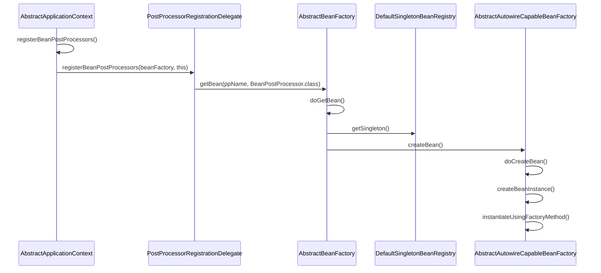
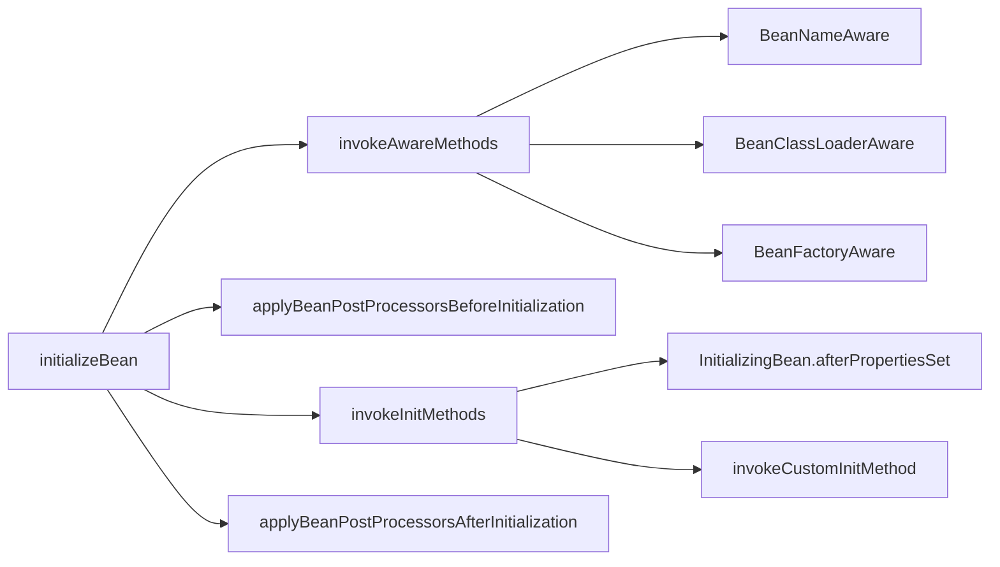

org.springframework.context.support.AbstractApplicationContext

```mermaid
sequenceDiagram
    AbstractApplicationContext ->> AbstractApplicationContext: registerBeanPostProcessors()
    AbstractApplicationContext ->> PostProcessorRegistrationDelegate: registerBeanPostProcessors(beanFactory, this)
    PostProcessorRegistrationDelegate ->> AbstractBeanFactory: getBean(ppName, BeanPostProcessor.class)
    %% 
    AbstractBeanFactory ->> AbstractBeanFactory: doGetBean()
    AbstractBeanFactory ->> DefaultSingletonBeanRegistry: getSingleton()
    AbstractBeanFactory ->> AbstractAutowireCapableBeanFactory: createBean()
    AbstractAutowireCapableBeanFactory ->> AbstractAutowireCapableBeanFactory: doCreateBean()
    AbstractAutowireCapableBeanFactory ->> AbstractAutowireCapableBeanFactory: createBeanInstance()
    AbstractAutowireCapableBeanFactory ->> AbstractAutowireCapableBeanFactory: instantiateUsingFactoryMethod()
```

```mermaid
graph LR
    %% AbstractAutowireCapableBeanFactory 初始化bean
    initializeBean --> invokeAwareMethods

    %% 感知方法
    invokeAwareMethods --> BeanNameAware
    invokeAwareMethods --> BeanClassLoaderAware
    invokeAwareMethods --> BeanFactoryAware

    %% 初始化之前
    initializeBean --> applyBeanPostProcessorsBeforeInitialization

    %% 初始化方法
    initializeBean --> invokeInitMethods
    invokeInitMethods --> InitializingBean.afterPropertiesSet
    invokeInitMethods --> invokeCustomInitMethod

    %% 初始化之后
    initializeBean --> applyBeanPostProcessorsAfterInitialization
```
