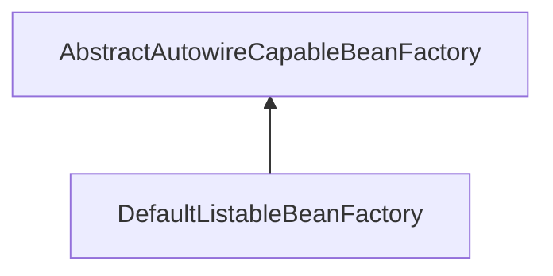
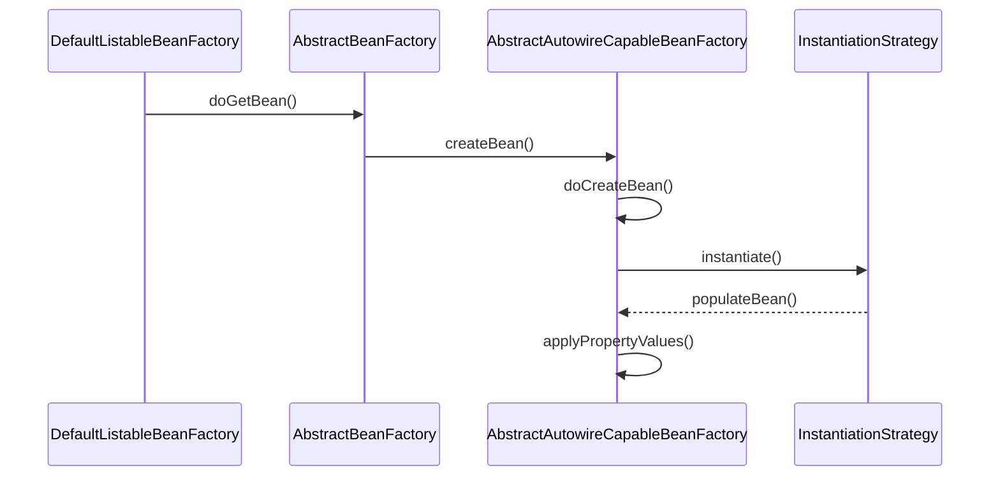

org.springframework.beans.factory.support.DefaultListableBeanFactory

```
DefaultListableBeanFactory
    AbstractAutowireCapableBeanFactory
        AbstractBeanFactory
            FactoryBeanRegistrySupport
                DefaultSingletonBeanRegistry
                    SimpleAliasRegistry
```




