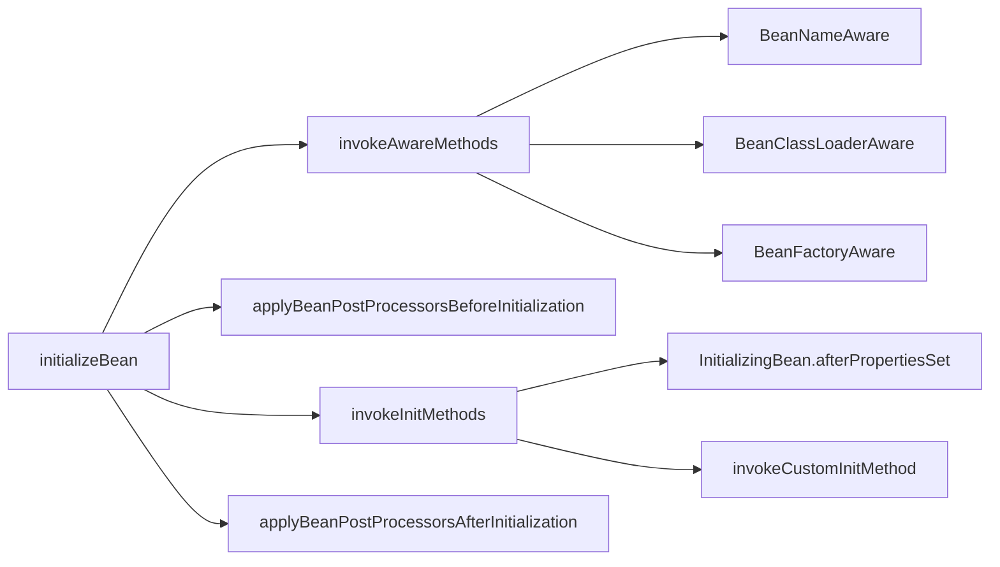

org.springframework.beans.factory.support.DefaultListableBeanFactory

## 1. DefaultListableBeanFactory 类图
```
SimpleAliasRegistry
    DefaultSingletonBeanRegistry
        FactoryBeanRegistrySupport
            AbstractBeanFactory
                AbstractAutowireCapableBeanFactory
                    DefaultListableBeanFactory
```

```yuml
// {type:class}

// extends
[SimpleAliasRegistry]^-[DefaultSingletonBeanRegistry]
[DefaultSingletonBeanRegistry]^-[FactoryBeanRegistrySupport]
[FactoryBeanRegistrySupport]^-[AbstractBeanFactory]
[AbstractBeanFactory]^-[AbstractAutowireCapableBeanFactory]
[AbstractAutowireCapableBeanFactory]^-[DefaultListableBeanFactory]
```


## 2. 依赖注入DI

### getBean()

```mermaid
sequenceDiagram
    
    Actor ->> AbstractBeanFactory: getBean()
    AbstractBeanFactory ->> AbstractBeanFactory: doGetBean()
    AbstractBeanFactory ->> DefaultSingletonBeanRegistry: getSingleton()
    AbstractBeanFactory ->> AbstractAutowireCapableBeanFactory: createBean()
    AbstractAutowireCapableBeanFactory ->> AbstractAutowireCapableBeanFactory: doCreateBean()
    AbstractAutowireCapableBeanFactory ->> AbstractAutowireCapableBeanFactory: createBeanInstance()
    AbstractAutowireCapableBeanFactory ->> AbstractAutowireCapableBeanFactory: instantiateUsingFactoryMethod()
```

### 依赖注入
```mermaid
sequenceDiagram
    participant Actor
    participant AbstractBeanFactory
    participant AbstractAutowireCapableBeanFactory

    Actor ->> AbstractBeanFactory: getBean()
    AbstractBeanFactory ->> AbstractBeanFactory: doGetBean()
    AbstractBeanFactory ->> AbstractAutowireCapableBeanFactory: createBean()
    AbstractAutowireCapableBeanFactory ->> AbstractAutowireCapableBeanFactory: doCreateBean()
    AbstractAutowireCapableBeanFactory ->> InstantiationStrategy: instantiate()
    InstantiationStrategy -->> AbstractAutowireCapableBeanFactory: populateBean()
    AbstractAutowireCapableBeanFactory ->> AbstractAutowireCapableBeanFactory: applyPropertyValues()
```

### 初始化bean
