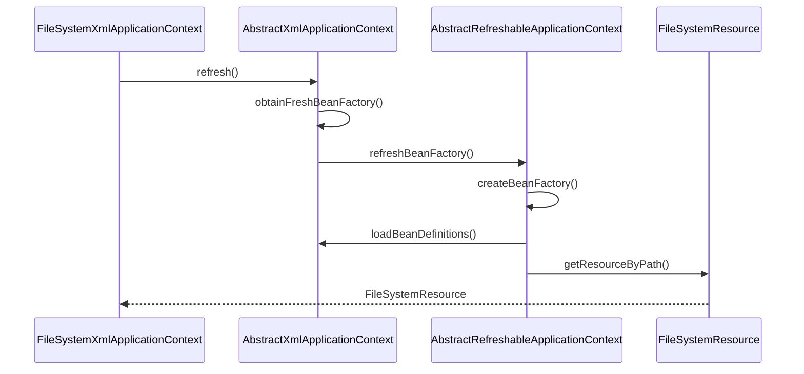
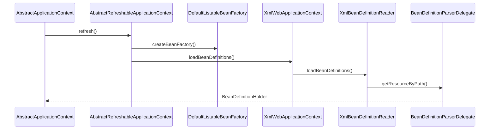

org.springframework.context.support.FileSystemXmlApplicationContext

```
FileSystemXmlApplicationContext
    AbstractXmlApplicationContext
        AbstractRefreshableConfigApplicationContext
            AbstractRefreshableApplicationContext
                AbstractApplicationContext
                    DefaultResourceLoader
```


#### BeanDefinition的ResourceLoader定位

#### BeanDefinition的载入于解析



#### BeanDefinition在IoC容器中的注册

