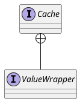

org.springframework.cache.Cache

## hierarchy
```
Cache (org.springframework.cache)
    NoOpCache (org.springframework.cache.support)
    EhCacheCache (org.springframework.cache.ehcache)
    AbstractValueAdaptingCache (org.springframework.cache.support)
        GuavaCache (org.springframework.cache.guava)
        ConcurrentMapCache (org.springframework.cache.concurrent)
        JCacheCache (org.springframework.cache.jcache)
        CaffeineCache (org.springframework.cache.caffeine)
        RedisCache (org.springframework.data.redis.cache)
    TransactionAwareCacheDecorator (org.springframework.cache.transaction)
```

## define



