org.springframework.cache

## package
```
annotation
    Cacheable
    CacheAnnotationParser
    CacheConfig
    CacheEvict
    CachePut
    Caching
concurrent
    ConcurrentMapCache
    ConcurrentMapCacheFactoryBean
    ConcurrentMapCacheManager
config
    AnnotationDrivenCacheBeanDefinitionParser
    CacheAdviceParser
    CacheManagementConfigUtils
    CacheNamespaceHandler
interceptor
    CacheInterceptor
    CacheAspectSupport
    KeyGenerator
support
    AbstractCacheManager
    CompositeCacheManager
    SimpleCacheManager
Cache
CacheManager
```

## overview

```plantuml
@startuml
'''''''''''''''''''''''''缓存抽象、缓存管理'''''''''''''''''''''''''
interface Cache  #yellow
interface CacheManager  #yellow

Cache +-- ValueWrapper
ValueWrapper ^-.. SimpleValueWrapper

CacheManager o-- Cache
CacheManager ^-- AbstractCacheManager
abstract class AbstractCacheManager
AbstractCacheManager ^-- AbstractTransactionSupportingCacheManager
abstract class AbstractTransactionSupportingCacheManager

'''''''''''''''''''''''''缓存实现'''''''''''''''''''''''''
abstract class AbstractValueAdaptingCache
AbstractValueAdaptingCache ^-- ConcurrentMapCache
CacheManager ^-- ConcurrentMapCacheManager


package spring-context-support {
    Cache ^.. EhCacheCache
    Cache ^.. AbstractValueAdaptingCache
    AbstractValueAdaptingCache ^-- GuavaCache
    AbstractValueAdaptingCache ^-- JCacheCache
}

'''''''''''''''''''''''''Redis实现'''''''''''''''''''''''''
package spring-data-redis {
    Cache ^.. RedisCache
    
    AbstractTransactionSupportingCacheManager ^---- RedisCacheManager
    
    RedisCacheManager o-- RedisCachePrefix
    RedisCacheManager ..> RedisCache
    RedisCacheManager o-- RedisOperations
    
    interface RedisOperations<K, V>
    RedisOperations ^.. RedisTemplate
    RedisTemplate ^-- StringRedisTemplate
    class RedisTemplate<K, V>
    class StringRedisTemplate
}

'''''''''''''''''''''''''缓存调用抽象'''''''''''''''''''''''''
abstract class AbstractCacheInvoker
AbstractCacheInvoker ..> Cache

interface ApplicationContextAware
interface InitializingBean
interface SmartInitializingSingleton

'''''''''''''''''''''''''缓存切面'''''''''''''''''''''''''
AbstractCacheInvoker ^----- CacheAspectSupport
ApplicationContextAware ^.. CacheAspectSupport
InitializingBean ^.. CacheAspectSupport
SmartInitializingSingleton ^.. CacheAspectSupport
abstract class CacheAspectSupport  #orange

CacheAspectSupport +-- CacheOperationContext
CacheAspectSupport ..> ExpressionEvaluator

CacheAspectSupport o-- CacheOperationSource
CacheAspectSupport o-- KeyGenerator
CacheAspectSupport o-- ExpressionEvaluator
CacheAspectSupport o-- CacheResolver

'''''''''''''''''''''''''缓存操作源'''''''''''''''''''''''''
interface CacheOperationSource
abstract class AbstractFallbackCacheOperationSource
CacheOperationSource ^-- AbstractFallbackCacheOperationSource
AbstractFallbackCacheOperationSource ^-- AnnotationCacheOperationSource

'''''''''''''''''''''''''缓存键'''''''''''''''''''''''''
interface KeyGenerator
KeyGenerator ^.. SimpleKeyGenerator
class SimpleKeyGenerator

'''''''''''''''''''''''''Advice'''''''''''''''''''''''''
CacheAspectSupport ^-- CacheInterceptor
interface MethodInterceptor
MethodInterceptor ^.. CacheInterceptor
class CacheInterceptor  #orange

CacheInterceptor o-- CacheOperationInvoker

'''''''''''''''''''''''''Proxy'''''''''''''''''''''''''
package spring-aop {
    class ProxyConfig
    
    ProxyConfig ^-- AbstractSingletonProxyFactoryBean
    FactoryBean ^.. AbstractSingletonProxyFactoryBean
    BeanClassLoaderAware ^.. AbstractSingletonProxyFactoryBean
    InitializingBean ^.. AbstractSingletonProxyFactoryBean
    abstract class AbstractSingletonProxyFactoryBean
    AbstractSingletonProxyFactoryBean o-- AdvisorAdapterRegistry
    
    ProxyConfig ^-- AdvisedSupport
    Advised ^.. AdvisedSupport
    AdvisedSupport ^-- ProxyCreatorSupport
    ProxyCreatorSupport ^-- ProxyFactory  
    AbstractSingletonProxyFactoryBean ..> ProxyFactory
    
    
    interface AdvisorAdapterRegistry
    AdvisorAdapterRegistry ^.. DefaultAdvisorAdapterRegistry
    DefaultAdvisorAdapterRegistry "1" o-- "*" AdvisorAdapter
    
    interface AdvisorAdapter
    AdvisorAdapter ^.. MethodBeforeAdviceAdapter
    AdvisorAdapter ^.. ThrowsAdviceAdapter
    AdvisorAdapter ^.. AfterReturningAdviceAdapter
}

AbstractSingletonProxyFactoryBean ^-- CacheProxyFactoryBean
class CacheProxyFactoryBean  #orange
CacheProxyFactoryBean o-- CacheInterceptor
CacheProxyFactoryBean o-- Pointcut

@enduml
```

