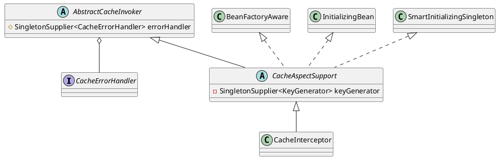

org.springframework.cache.interceptor.CacheInterceptor

## hierarchy
```
AbstractCacheInvoker (org.springframework.cache.interceptor)
    CacheAspectSupport (org.springframework.cache.interceptor)
        CacheInterceptor (org.springframework.cache.interceptor)
```

## define
