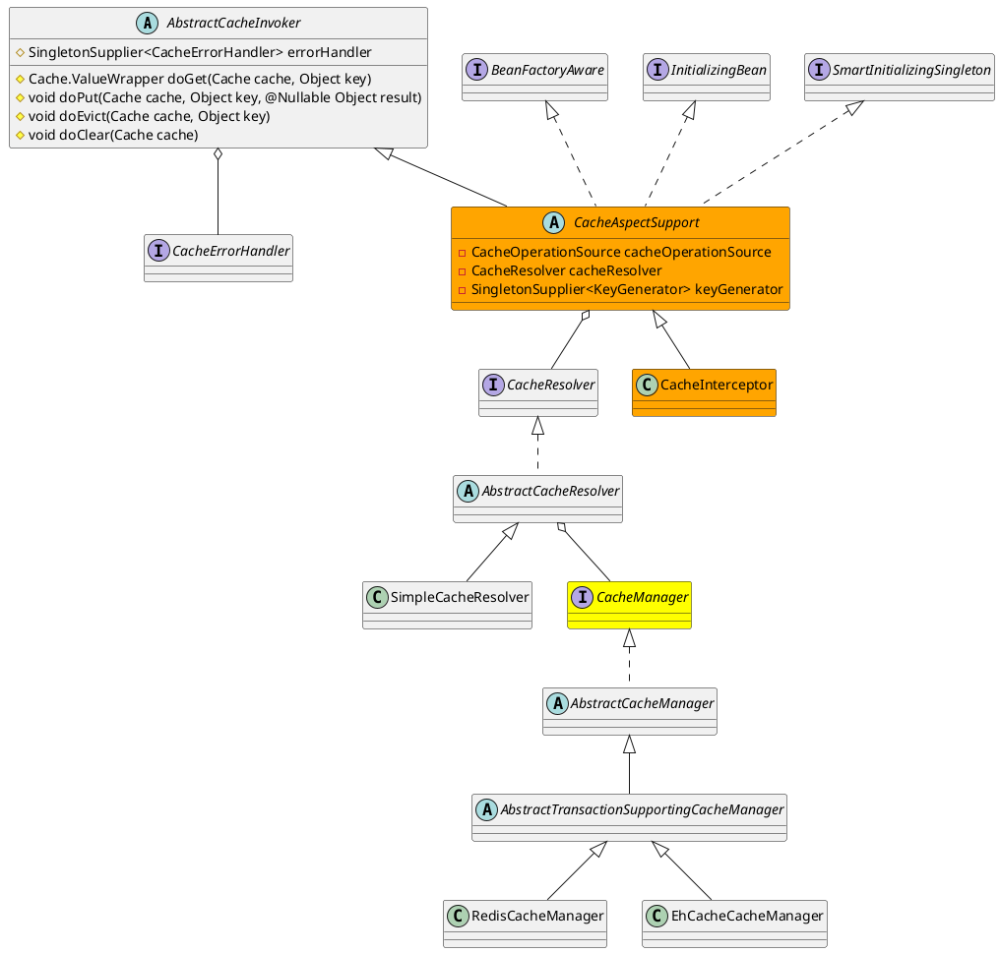

org.springframework.cache.interceptor.CacheInterceptor

## hierarchy
```
AbstractCacheInvoker (org.springframework.cache.interceptor)
    CacheAspectSupport (org.springframework.cache.interceptor)
        CacheInterceptor (org.springframework.cache.interceptor)
CacheInterceptor (org.springframework.cache.interceptor)
    CacheAspectSupport (org.springframework.cache.interceptor)
        AbstractCacheInvoker (org.springframework.cache.interceptor)
        BeanFactoryAware (org.springframework.beans.factory)
            Aware (org.springframework.beans.factory)
        InitializingBean (org.springframework.beans.factory)
        SmartInitializingSingleton (org.springframework.beans.factory)
    MethodInterceptor (org.aopalliance.intercept)
        Interceptor (org.aopalliance.intercept)
            Advice (org.aopalliance.aop)
```

## define


## invoke
```
testSpringCache:34, ActivityBaseServiceImpl (com.only.test.biz.service.act.impl)
invoke:-1, ActivityBaseServiceImpl$$FastClassBySpringCGLIB$$315ba98 (com.only.test.biz.service.act.impl)
invoke:218, MethodProxy (org.springframework.cglib.proxy)

invokeJoinpoint:749, CglibAopProxy$CglibMethodInvocation (org.springframework.aop.framework)
proceed:163, ReflectiveMethodInvocation (org.springframework.aop.framework)

lambda$invoke$0:53, CacheInterceptor (org.springframework.cache.interceptor)
invoke:-1, 1055139629 (org.springframework.cache.interceptor.CacheInterceptor$$Lambda$580)

invokeOperation:365, CacheAspectSupport (org.springframework.cache.interceptor)
execute:420, CacheAspectSupport (org.springframework.cache.interceptor)
execute:345, CacheAspectSupport (org.springframework.cache.interceptor)

// 缓存拦截
invoke:61, CacheInterceptor (org.springframework.cache.interceptor)

proceed:186, ReflectiveMethodInvocation (org.springframework.aop.framework)

// cglib拦截器
intercept:688, CglibAopProxy$DynamicAdvisedInterceptor (org.springframework.aop.framework)

// cglib代理
testSpringCache:-1, ActivityBaseServiceImpl$$EnhancerBySpringCGLIB$$eeafa20 (com.only.test.biz.service.act.impl)

doInRpcMethod:40, TestFacadeImpl$1 (com.only.test.facade.impl.act)
doInRpcMethod:36, TestFacadeImpl$1 (com.only.test.facade.impl.act)
doInRpc:19, RpcCallbackWithoutParameter (com.test.onion.support.simple.crud.rpc.support)
doInRpc:15, RpcCallbackWithoutParameter (com.test.onion.support.simple.crud.rpc.support)
execute:37, RpcTemplate (com.test.onion.support.simple.crud.rpc.support)
execute:66, RpcTemplate (com.test.onion.support.simple.crud.rpc.support)
execute:25, AbstractRpcTemplate (com.test.onion.support.simple.crud.rpc.impl)
findOneUnderwayActivity:36, TestFacadeImpl (com.only.test.facade.impl.act)

invokeMethod:-1, Wrapper5 (com.alibaba.dubbo.common.bytecode)
doInvoke:46, JavassistProxyFactory$1 (com.alibaba.dubbo.rpc.proxy.javassist)
invoke:72, AbstractProxyInvoker (com.alibaba.dubbo.rpc.proxy)
invoke:53, InvokerWrapper (com.alibaba.dubbo.rpc.protocol)

invoke:64, ExceptionFilter (com.alibaba.dubbo.rpc.filter)
invoke:69, ProtocolFilterWrapper$1 (com.alibaba.dubbo.rpc.protocol)
invoke:65, MonitorFilter (com.alibaba.dubbo.monitor.support)
invoke:69, ProtocolFilterWrapper$1 (com.alibaba.dubbo.rpc.protocol)
invoke:42, TimeoutFilter (com.alibaba.dubbo.rpc.filter)
invoke:69, ProtocolFilterWrapper$1 (com.alibaba.dubbo.rpc.protocol)
invoke:78, TraceFilter (com.alibaba.dubbo.rpc.protocol.dubbo.filter)
invoke:69, ProtocolFilterWrapper$1 (com.alibaba.dubbo.rpc.protocol)
invoke:23, DubboLogTraceFilter (com.only.test.middleware.log.filter)
invoke:69, ProtocolFilterWrapper$1 (com.alibaba.dubbo.rpc.protocol)
invoke:61, ContextFilter (com.alibaba.dubbo.rpc.filter)
invoke:69, ProtocolFilterWrapper$1 (com.alibaba.dubbo.rpc.protocol)
invoke:132, GenericFilter (com.alibaba.dubbo.rpc.filter)
invoke:69, ProtocolFilterWrapper$1 (com.alibaba.dubbo.rpc.protocol)
invoke:38, ClassLoaderFilter (com.alibaba.dubbo.rpc.filter)
invoke:69, ProtocolFilterWrapper$1 (com.alibaba.dubbo.rpc.protocol)
invoke:38, EchoFilter (com.alibaba.dubbo.rpc.filter)
invoke:69, ProtocolFilterWrapper$1 (com.alibaba.dubbo.rpc.protocol)

// 协议
reply:102, DubboProtocol$1 (com.alibaba.dubbo.rpc.protocol.dubbo)

// 头
handleRequest:98, HeaderExchangeHandler (com.alibaba.dubbo.remoting.exchange.support.header)
received:170, HeaderExchangeHandler (com.alibaba.dubbo.remoting.exchange.support.header)

// 解码
received:52, DecodeHandler (com.alibaba.dubbo.remoting.transport)

// 通道事件任务
run:81, ChannelEventRunnable (com.alibaba.dubbo.remoting.transport.dispatcher)

// thread pool
runWorker:1149, ThreadPoolExecutor (java.util.concurrent)
run:624, ThreadPoolExecutor$Worker (java.util.concurrent)
run:748, Thread (java.lang)
```