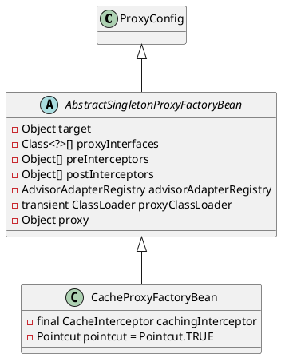

org.springframework.cache.interceptor.CacheProxyFactoryBean

## hierarchy
```
ProxyConfig (org.springframework.aop.framework)
    ScopedProxyFactoryBean (org.springframework.aop.scope)
    ProxyProcessorSupport (org.springframework.aop.framework)
    AbstractSingletonProxyFactoryBean (org.springframework.aop.framework)
        TransactionProxyFactoryBean (org.springframework.transaction.interceptor)
        CacheProxyFactoryBean (org.springframework.cache.interceptor)
    AdvisedSupport (org.springframework.aop.framework)
        ProxyCreatorSupport (org.springframework.aop.framework)
            ProxyFactoryBean (org.springframework.aop.framework)
            ProxyFactory (org.springframework.aop.framework)
            AspectJProxyFactory (org.springframework.aop.aspectj.annotation)
```

## define
