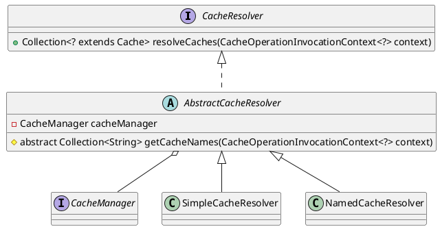

org.springframework.cache.interceptor.CacheResolver

## hierarchy
```
CacheResolver (org.springframework.cache.interceptor)
    AbstractCacheResolver (org.springframework.cache.interceptor)
        SimpleCacheResolver (org.springframework.cache.interceptor)
        NamedCacheResolver (org.springframework.cache.interceptor)
```

## define
