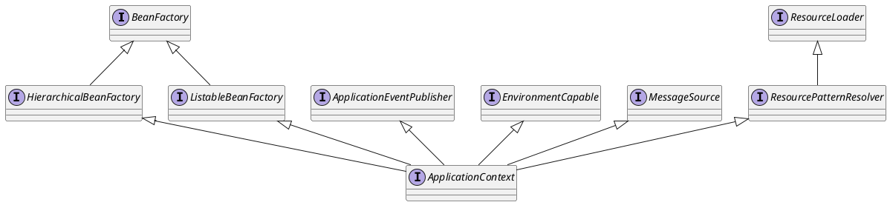

org.springframework.context.ApplicationContext

## hierarchy

## define

```plantuml
@startuml

'''''''''''' 容器相关 ''''''''''''
interface BeanFactory
interface HierarchicalBeanFactory
interface ListableBeanFactory
BeanFactory ^-- HierarchicalBeanFactory
BeanFactory ^-- ListableBeanFactory

'''''''''''' 应用事件发布 ''''''''''''
interface ApplicationEventPublisher

'''''''''''' 环境感知 ''''''''''''
interface EnvironmentCapable

'''''''''''' 消息源 ''''''''''''
interface MessageSource

'''''''''''' 资源加载 ''''''''''''
interface ResourceLoader
interface ResourcePatternResolver
ResourceLoader ^-- ResourcePatternResolver

'''''''''''' 应用上下文 ''''''''''''
interface ApplicationContext
HierarchicalBeanFactory ^-- ApplicationContext
ListableBeanFactory ^-- ApplicationContext
ApplicationEventPublisher ^-- ApplicationContext
EnvironmentCapable ^-- ApplicationContext
MessageSource ^-- ApplicationContext
ResourcePatternResolver ^-- ApplicationContext

@enduml
```
