org.springframework.context.support.AbstractApplicationContext

## hierarchy
```
DefaultResourceLoader (org.springframework.core.io)
    AbstractApplicationContext (org.springframework.context.support)
        AbstractRefreshableApplicationContext (org.springframework.context.support)
            AbstractRefreshableConfigApplicationContext (org.springframework.context.support)
                AnnotationConfigReactiveWebApplicationContext (org.springframework.boot.web.reactive.context)
                AbstractXmlApplicationContext (org.springframework.context.support)
                    FileSystemXmlApplicationContext (org.springframework.context.support)
                    ClassPathXmlApplicationContext (org.springframework.context.support)
                AbstractRefreshableWebApplicationContext (org.springframework.web.context.support)
                    XmlWebApplicationContext (org.springframework.web.context.support)
                    GroovyWebApplicationContext (org.springframework.web.context.support)
                    AnnotationConfigWebApplicationContext (org.springframework.web.context.support)
        GenericApplicationContext (org.springframework.context.support)
            GenericXmlApplicationContext (org.springframework.context.support)
            StaticApplicationContext (org.springframework.context.support)
            GenericWebApplicationContext (org.springframework.web.context.support)
                ServletWebServerApplicationContext (org.springframework.boot.web.servlet.context)
                    AnnotationConfigServletWebServerApplicationContext (org.springframework.boot.web.servlet.context)
                    XmlServletWebServerApplicationContext (org.springframework.boot.web.servlet.context)
            ResourceAdapterApplicationContext (org.springframework.jca.context)
            GenericGroovyApplicationContext (org.springframework.context.support)
            AnnotationConfigApplicationContext (org.springframework.context.annotation)
            GenericReactiveWebApplicationContext (org.springframework.boot.web.reactive.context)
                ReactiveWebServerApplicationContext (org.springframework.boot.web.reactive.context)
                    AnnotationConfigReactiveWebServerApplicationContext (org.springframework.boot.web.reactive.context)
```

## class

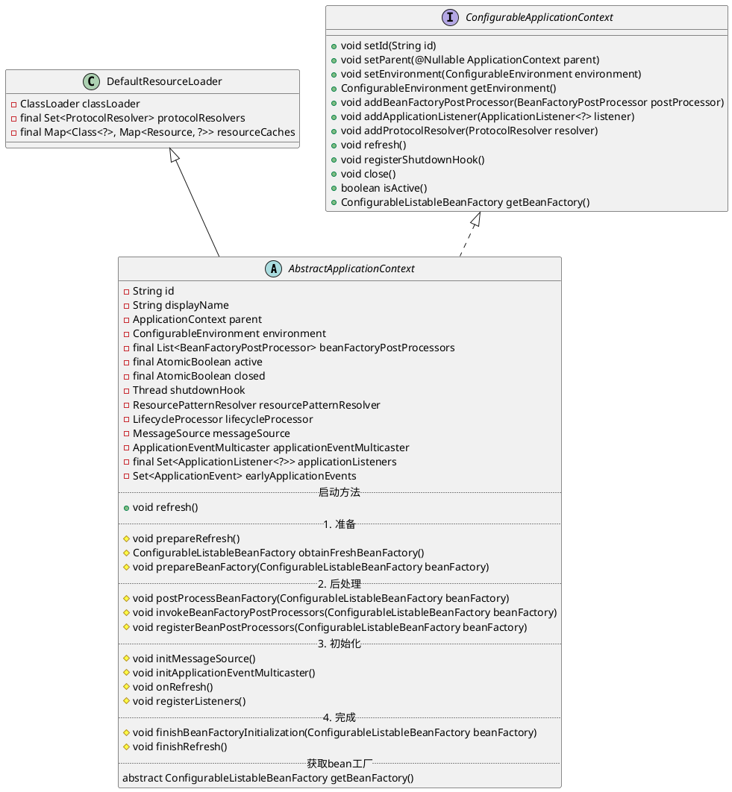

## refresh()
tomcat环境下spring启动，通过ContextLoader加载

四大阶段、十二子过程

| 阶段       | 关键词      | 子过程                                                                            |
| :--------- | :---------- | :-------------------------------------------------------------------------------- |
| 准备阶段   | prepare     | prepareRefresh obtainFreshBeanFactory prepareBeanFactory                          |
| 后处理阶段 | postProcess | postProcessBeanFactory invokeBeanFactoryPostProcessors registerBeanPostProcessors |
| 初始化阶段 | init        | initMessageSource initApplicationEventMulticaster onRefresh registerListeners     |
| 完成阶段   | finish      | finishBeanFactoryInitialization finishRefresh                                     |

### 过程一：准备阶段

#### 1. 准备刷新 prepareRefresh();
设置启动时间、活动状态标志、验证属性配置

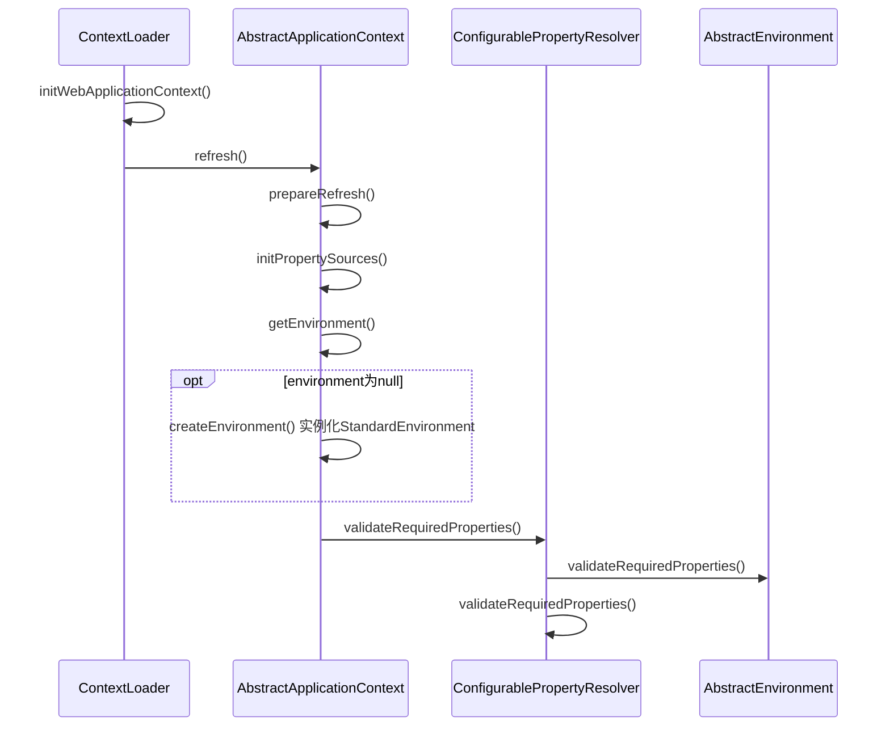
#### 2. 获得刷新工厂 obtainFreshBeanFactory();
实例化bean工厂，资源定位、bean定义验证解析、bean定义注册

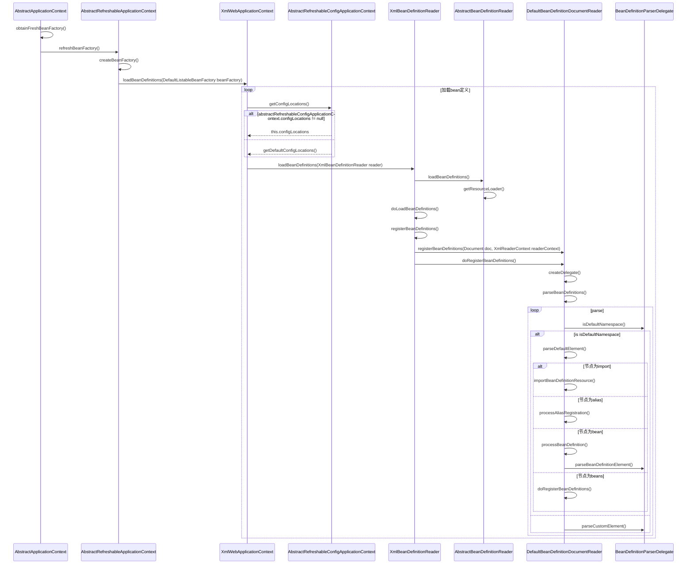
#### 3. 准备工厂 prepareBeanFactory(beanFactory);
设置类加载器，忽略内置接口，忽略依赖的接口、注册可解析的依赖、准备环境bean

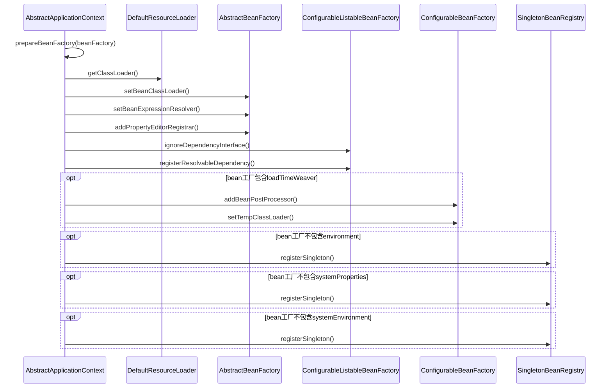

### 过程二：后置处理阶段

#### 4. 后处理工厂postProcessBeanFactory(beanFactory);
模板方法，此时所有的bean definitions已经被加载，但是都没有实例化。
这样可以允许注册特殊的后置处理器（BeanPostProcessors）

#### 5. 调用工厂后处理器 invokeBeanFactoryPostProcessors(beanFactory);
Invoke factory processors registered as beans in the context.

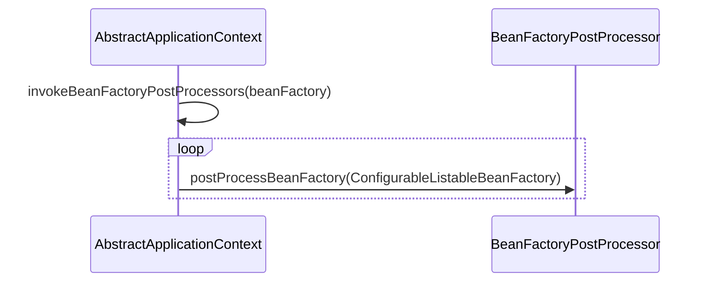

#### 6. registerBeanPostProcessors(beanFactory);
Register bean processors that intercept bean creation.

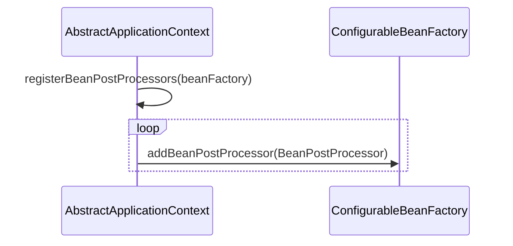

### 过程三：初始化阶段
Initialize message source for this context.
初始化国际化资源、事件广播器、注册监听器

#### 7. initMessageSource();
国际化

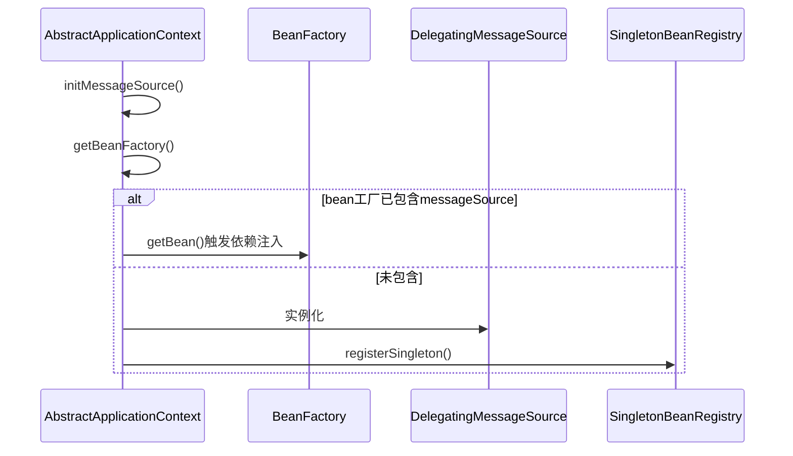

#### 8. initApplicationEventMulticaster();
初始化应用事件多路广播器

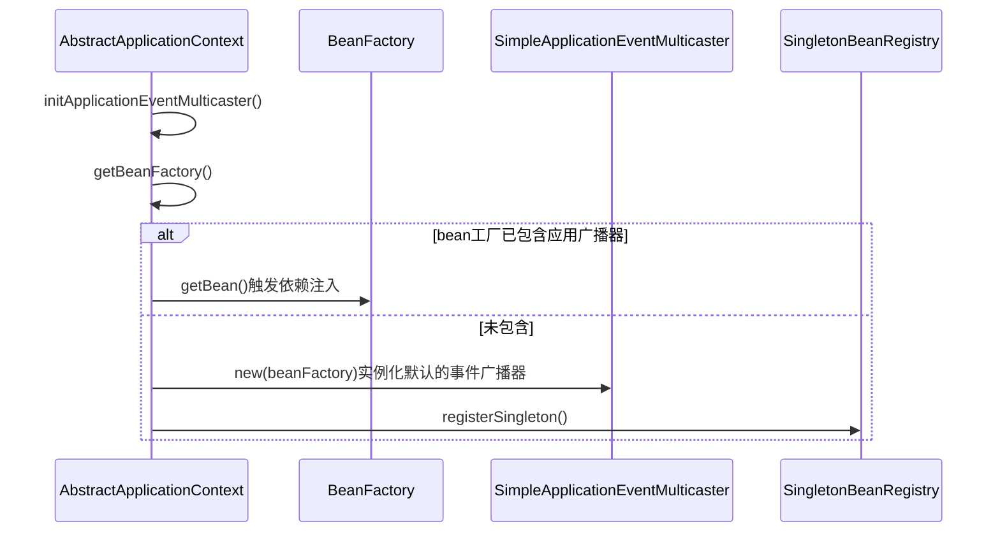

#### 9. onRefresh();
模板方法

#### 10. registerListeners();
注册监听器

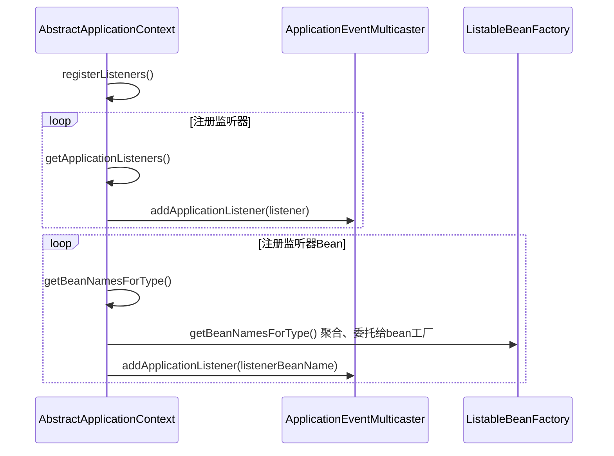

### 过程四：完成阶段
#### 11. finishBeanFactoryInitialization(beanFactory);

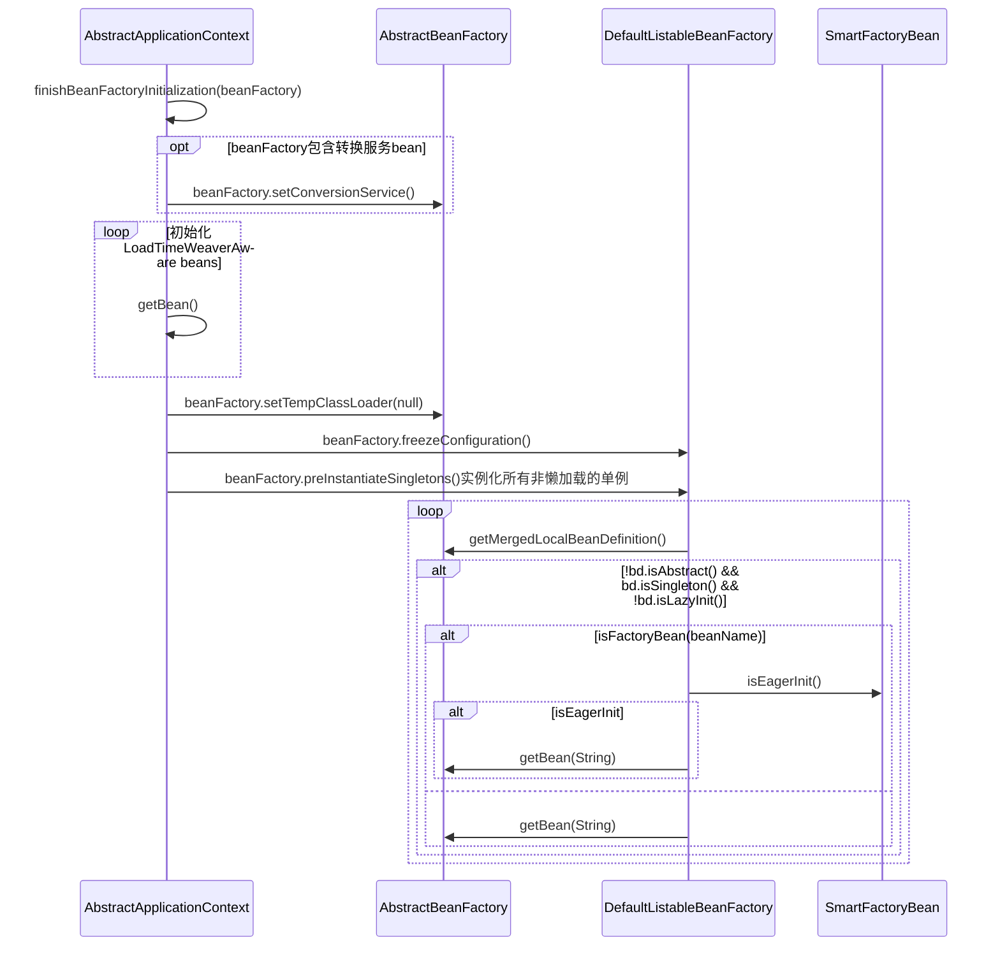

#### 12. finishRefresh();
生命周期处理器、发布事件

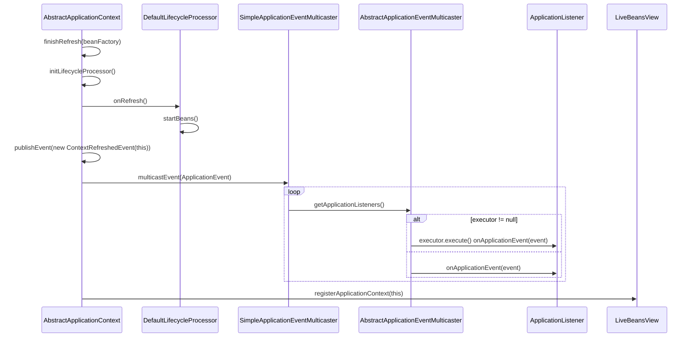

#### 异常情况
destroyBeans();
cancelRefresh(ex);


## idea uml
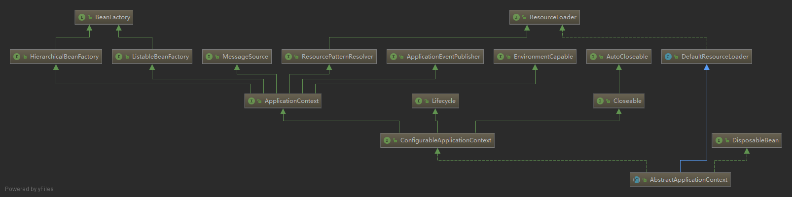

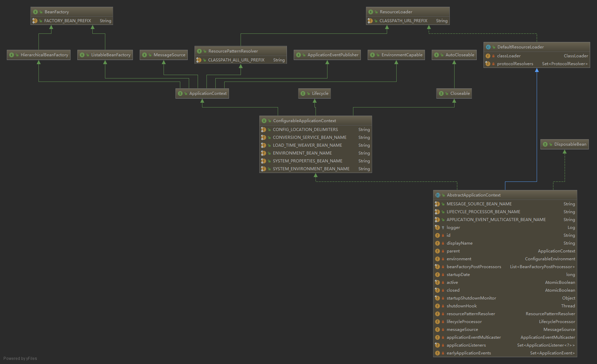