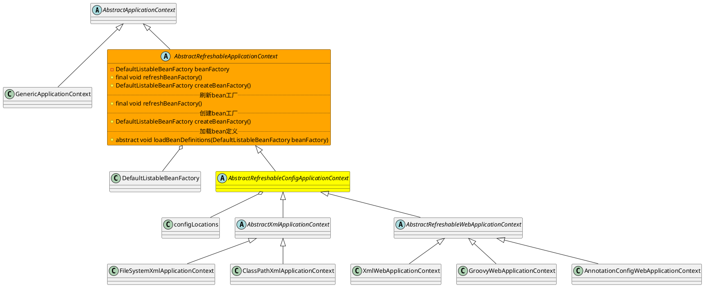

org.springframework.context.support.AbstractRefreshableApplicationContext

## hierarchy
```
DefaultResourceLoader (org.springframework.core.io)
    AbstractApplicationContext (org.springframework.context.support)
        AbstractRefreshableApplicationContext (org.springframework.context.support)
            AbstractRefreshableConfigApplicationContext (org.springframework.context.support)
                AnnotationConfigReactiveWebApplicationContext (org.springframework.boot.web.reactive.context)
                AbstractXmlApplicationContext (org.springframework.context.support)
                    FileSystemXmlApplicationContext (org.springframework.context.support)
                    ClassPathXmlApplicationContext (org.springframework.context.support)
                AbstractRefreshableWebApplicationContext (org.springframework.web.context.support)
                    XmlWebApplicationContext (org.springframework.web.context.support)
                    GroovyWebApplicationContext (org.springframework.web.context.support)
                    AnnotationConfigWebApplicationContext (org.springframework.web.context.support)
            GenericApplicationContext (org.springframework.context.support)
                AnnotationConfigApplicationContext (org.springframework.context.annotation)
                    GenericWebApplicationContext (org.springframework.web.context.support)
                        EmbeddedWebApplicationContext (org.springframework.boot.context.embedded)
                            AnnotationConfigEmbeddedWebApplicationContext (org.springframework.boot.context.embedded) 1.5.9
                            XmlEmbeddedWebApplicationContext (org.springframework.boot.context.embedded)
                        ServletWebServerApplicationContext (org.springframework.boot.web.servlet.context)
                            AnnotationConfigServletWebServerApplicationContext (org.springframework.boot.web.servlet.context) 2.0.3
                            XmlServletWebServerApplicationContext (org.springframework.boot.web.servlet.context)
```

## define
* 实例域
  * DefaultListableBeanFactory
* 实例方法
  * refreshBeanFactory
* 抽象方法
  * loadBeanDefinitions 加载bean定义

