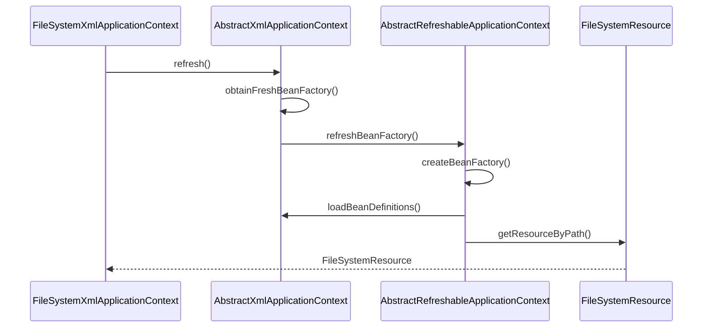
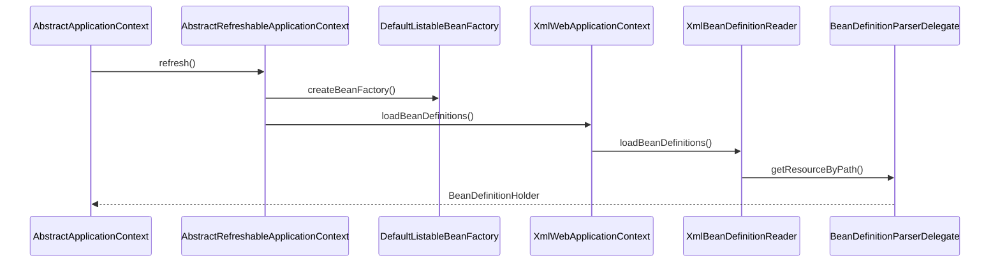
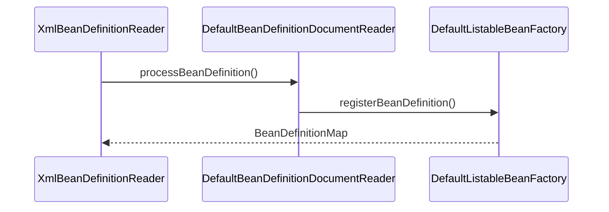

org.springframework.context.support.FileSystemXmlApplicationContext

## context加载
* ResourceLoader 定位
* BeanDefinition 加载、解析
* BeanDefinitionRegistry 注册

类加载：加载、链接（验证、准备、解析）、初始化

### BeanDefinition的ResourceLoader定位
* refresh
* obtainFreshBeanFactory
* refreshBeanFactory


### BeanDefinition的载入于解析
* createBeanFactory
* loadBeanDefinitions



### BeanDefinition在IoC容器中的注册




## 几个context

### FileSystemXmlApplicationContext
org.springframework.context.support.FileSystemXmlApplicationContext
```
DefaultResourceLoader
    AbstractApplicationContext
        AbstractRefreshableApplicationContext
            AbstractRefreshableConfigApplicationContext
                AbstractXmlApplicationContext
                    FileSystemXmlApplicationContext
```

### ClassPathXmlApplicationContext
org.springframework.context.support.ClassPathXmlApplicationContext
```
DefaultResourceLoader
    AbstractApplicationContext
        AbstractRefreshableApplicationContext
            AbstractRefreshableConfigApplicationContext
                AbstractXmlApplicationContext
                    ClassPathXmlApplicationContext
```

### XmlWebApplicationContext
org.springframework.web.context.support.XmlWebApplicationContext
```
DefaultResourceLoader
    AbstractApplicationContext
        AbstractRefreshableApplicationContext
            AbstractRefreshableConfigApplicationContext
                AbstractRefreshableWebApplicationContext
                    XmlWebApplicationContext
```

### AnnotationConfigEmbeddedWebApplicationContext
org.springframework.boot.context.embedded.AnnotationConfigEmbeddedWebApplicationContext
```
DefaultResourceLoader
    AbstractApplicationContext
        GenericApplicationContext
            GenericWebApplicationContext
                EmbeddedWebApplicationContext
                    AnnotationConfigEmbeddedWebApplicationContext
```

