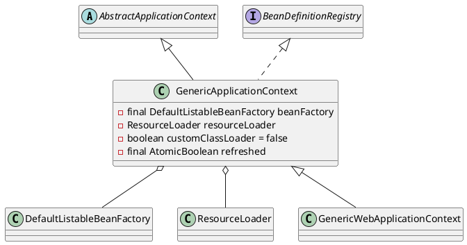

org.springframework.context.support.GenericApplicationContext

* AtomicBoolean

## hierarchy
* GenericApplicationContext
  * GenericWebApplicationContext
    * EmbeddedWebApplicationContext
    * ServletWebServerApplicationContext

```
DefaultResourceLoader (org.springframework.core.io)
    AbstractApplicationContext (org.springframework.context.support)
        GenericApplicationContext (org.springframework.context.support)
            GenericXmlApplicationContext (org.springframework.context.support)
            ResourceAdapterApplicationContext (org.springframework.jca.context)
            GenericGroovyApplicationContext (org.springframework.context.support)
            AnnotationConfigApplicationContext (org.springframework.context.annotation)
            StaticApplicationContext (org.springframework.context.support)
                StaticWebApplicationContext (org.springframework.web.context.support)
            GenericWebApplicationContext (org.springframework.web.context.support)
                EmbeddedWebApplicationContext (org.springframework.boot.context.embedded)
                    AnnotationConfigEmbeddedWebApplicationContext (org.springframework.boot.context.embedded)
                    XmlEmbeddedWebApplicationContext (org.springframework.boot.context.embedded)
                ServletWebServerApplicationContext (org.springframework.boot.web.servlet.context)
                    AnnotationConfigServletWebServerApplicationContext (org.springframework.boot.web.servlet.context)
                    XmlServletWebServerApplicationContext (org.springframework.boot.web.servlet.context)
```

## define


