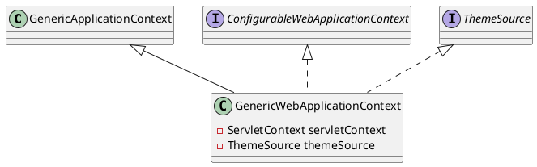

org.springframework.web.context.support.GenericWebApplicationContext

## hierarchy
```
DefaultResourceLoader (org.springframework.core.io)
    AbstractApplicationContext (org.springframework.context.support)
        GenericApplicationContext (org.springframework.context.support)
            GenericWebApplicationContext (org.springframework.web.context.support)
                EmbeddedWebApplicationContext (org.springframework.boot.context.embedded)
                    AnnotationConfigEmbeddedWebApplicationContext (org.springframework.boot.context.embedded)
                    XmlEmbeddedWebApplicationContext (org.springframework.boot.context.embedded)
                ServletWebServerApplicationContext (org.springframework.boot.web.servlet.context)
                    AnnotationConfigServletWebServerApplicationContext (org.springframework.boot.web.servlet.context)
                    XmlServletWebServerApplicationContext (org.springframework.boot.web.servlet.context)
```

## define

