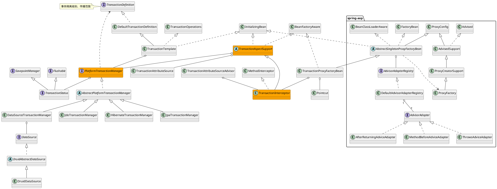

## spring-tx
* dao
* jca
* transaction
  * [PlatformTransactionManager](/20-framework/src/spring/spring-tx/transaction/PlatformTransactionManager.md)
  * [TransactionDefinition](/20-framework/src/spring/spring-tx/transaction/TransactionDefinition.md)
  * [TransactionInterceptor](/20-framework/src/spring/spring-tx/transaction/interceptor/TransactionInterceptor.md)
  * [TransactionProxyFactoryBean](/20-framework/src/spring/spring-tx/transaction/interceptor/TransactionProxyFactoryBean.md)

## package
org.springframework
```
dao
    support
        DaoSupport
jca
    cci
    context
    endpoint
    support
    work
transaction
    annotation
        Isolation 4种隔离级别
        Propagation 7种传播范围
        Transactional
        TransactionAnnotationParser
    config
    event
    interceptor
        TransactionInterceptor
        TransactionProxyFactoryBean
    jta
        JtaAfterCompletionSynchronization
        JtaTransactionManager
        JtaTransactionObject
        ManagedTransactionAdapter
        SimpleTransactionFactory
        SpringJtaSynchronizationAdapter
        TransactionFactory
        UserTransactionAdapter
        WebLogicJtaTransactionManager
        WebSphereUowTransactionManager
    support
        AbstractPlatformTransactionManager
        AbstractTransactionStatus
        ResourceHolder
        ResourceTransactionManager
        TransactionCallback
        TransactionSynchronization
        TransactionOperations
        TransactionTemplate
    PlatformTransactionManager
    SavepointManager
    TransactionDefinition
    TransactionStatus
```

## overview
* TransactionProxyFactoryBean
  * Pointcut
  * TransactionInterceptor extends TransactionAspectSupport
    * TransactionAttributeSource
    * PlatformTransactionManager
      * HibernateTransactionManager
      * JpaTransactionManager
      * DataSourceTransactionManager
* TransactionTemplate
  * PlatformTransactionManager
* TransactionAttributeSourceAdvisor
  * TransactionInterceptor
  
